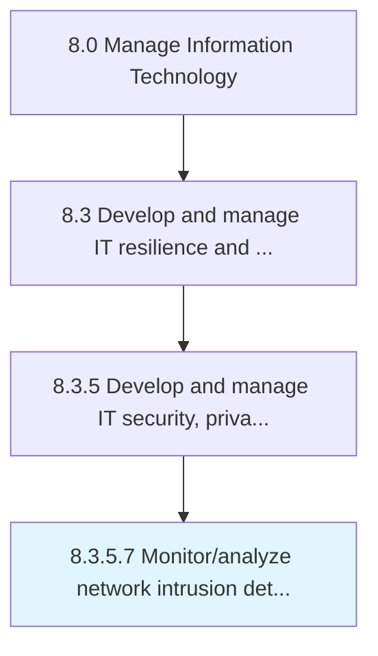

# Monitor/analyze network intrusion detection data and resolve threats

> Monitoring and evaluating network intrusion detection for any malicious activity or policy violations.

## Overview

Activity 8.3.5.7 is an activity within the Manage Information Technology framework. 

Monitoring and evaluating network intrusion detection for any malicious activity or policy violations. Identify the gaps in order to resolve threats and enhance existing network security.

## Process Hierarchy



## Key Statistics

| Metric | Value |
|--------|-------|
| APQC Code | 20742 |
| Hierarchy ID | 8.3.5.7 |
| Level | Activity |
| Parent | [8.3.5](../) |
| Sub-Processes | 0 |


## GraphDL Semantic Structure

```
monitor/analyze.NetworkIntrusionDetectionDataAndResolveThreats
```

| Component | Value | Description |
|-----------|-------|-------------|
| Verb | `monitor/analyze` | Primary action |
| Object | `network intrusion detection data and resolve threats` | Direct object |


## Related Concepts

- NetworkIntrusionDetectionDataResolveThreats
- NetworkIntrusionDetectionDataResolveThreats


---

*Source: APQC PCF 20742 (8.3.5.7) - APQC*
