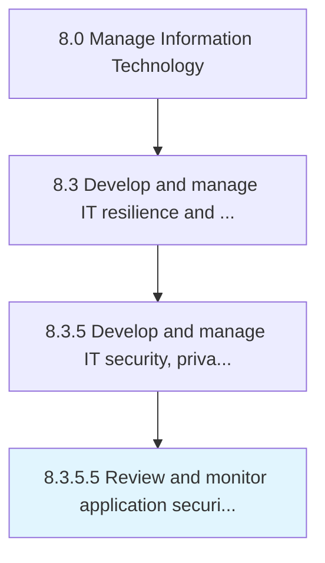

# Review and monitor application security controls

> Identifying, examining, and reviewing security control for IT applications.

## Overview

Activity 8.3.5.5 is an activity within the Manage Information Technology framework. 

Identifying, examining, and reviewing security control for IT applications. Test, analyze, and implement security protocols in order to safeguard IT applications.

## Process Hierarchy



## Key Statistics

| Metric | Value |
|--------|-------|
| APQC Code | 20740 |
| Hierarchy ID | 8.3.5.5 |
| Level | Activity |
| Parent | [8.3.5](../) |
| Sub-Processes | 0 |


## GraphDL Semantic Structure

```
review.AndMonitorApplicationSecurityControls
```

| Component | Value | Description |
|-----------|-------|-------------|
| Verb | `review` | Primary action |
| Object | `and monitor application security controls` | Direct object |


## Related Concepts

- ApplicationSecurityControls
- ApplicationSecurityControls


---

*Source: APQC PCF 20740 (8.3.5.5) - APQC*
