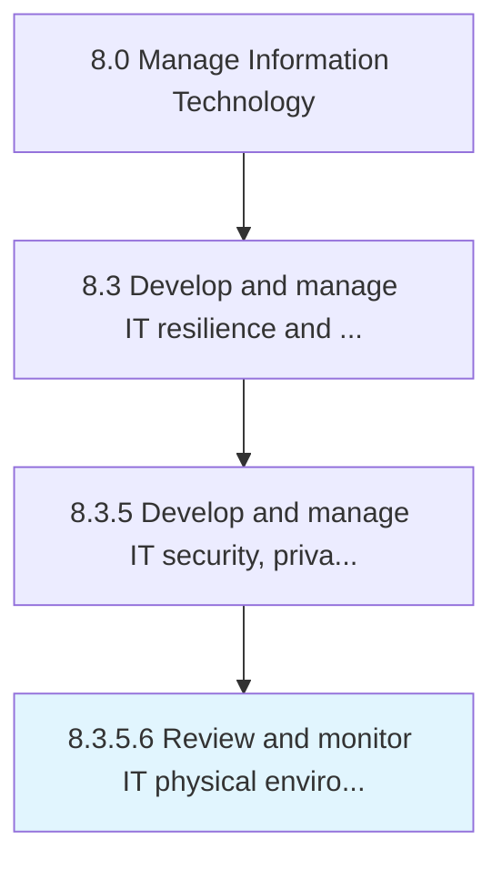

# Review and monitor IT physical environment security controls

> Identifying and examining security controls for physical environment of information technology such as business facilities, equipment, and resources.

## Overview

Activity 8.3.5.6 is an activity within the Manage Information Technology framework. 

Identifying and examining security controls for physical environment of information technology such as business facilities, equipment, and resources.

## Process Hierarchy



## Key Statistics

| Metric | Value |
|--------|-------|
| APQC Code | 20741 |
| Hierarchy ID | 8.3.5.6 |
| Level | Activity |
| Parent | [8.3.5](../) |
| Sub-Processes | 0 |


## GraphDL Semantic Structure

```
review.AndMonitorITPhysicalEnvironmentSecurityControls
```

| Component | Value | Description |
|-----------|-------|-------------|
| Verb | `review` | Primary action |
| Object | `and monitor IT physical environment security controls` | Direct object |


## Related Concepts

- [ITPhysicalEnvironmentSecurityControls](/concepts/ITPhysicalEnvironmentSecurityControls)
- [ITPhysicalEnvironmentSecurityControls](/concepts/ITPhysicalEnvironmentSecurityControls)


---

*Source: APQC PCF 20741 (8.3.5.6) - APQC*
