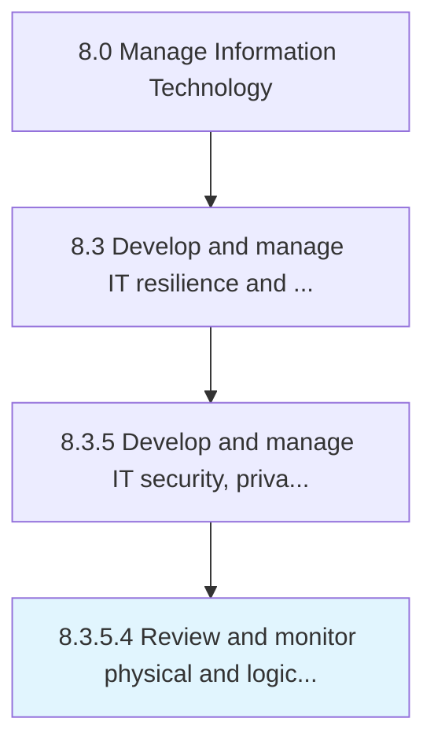

# Review and monitor physical and logical IT data security measures

> Identifying, examining, and reviewing physical and logical IT data security measures such as hardware security (smart cards), cryptographic protocols, and access control.

## Overview

Activity 8.3.5.4 is an activity within the Manage Information Technology framework. 

Identifying, examining, and reviewing physical and logical IT data security measures such as hardware security (smart cards), cryptographic protocols, and access control.

## Process Hierarchy



## Key Statistics

| Metric | Value |
|--------|-------|
| APQC Code | 20739 |
| Hierarchy ID | 8.3.5.4 |
| Level | Activity |
| Parent | [8.3.5](../) |
| Sub-Processes | 0 |


## GraphDL Semantic Structure

```
review.AndMonitorPhysicalAndLogicalITDataSecurityMeasures
```

| Component | Value | Description |
|-----------|-------|-------------|
| Verb | `review` | Primary action |
| Object | `and monitor physical and logical IT data security measures` | Direct object |


## Related Concepts

- [PhysicalITDataSecurityMeasures](/concepts/PhysicalITDataSecurityMeasures)
- [LogicalITDataSecurityMeasures](/concepts/LogicalITDataSecurityMeasures)
- [PhysicalITDataSecurityMeasures](/concepts/PhysicalITDataSecurityMeasures)
- [LogicalITDataSecurityMeasures](/concepts/LogicalITDataSecurityMeasures)


---

*Source: APQC PCF 20739 (8.3.5.4) - APQC*
