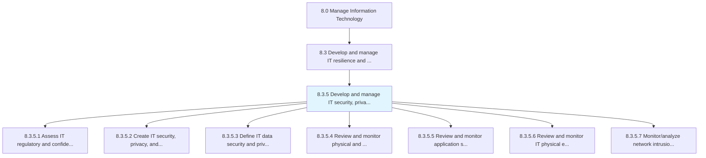
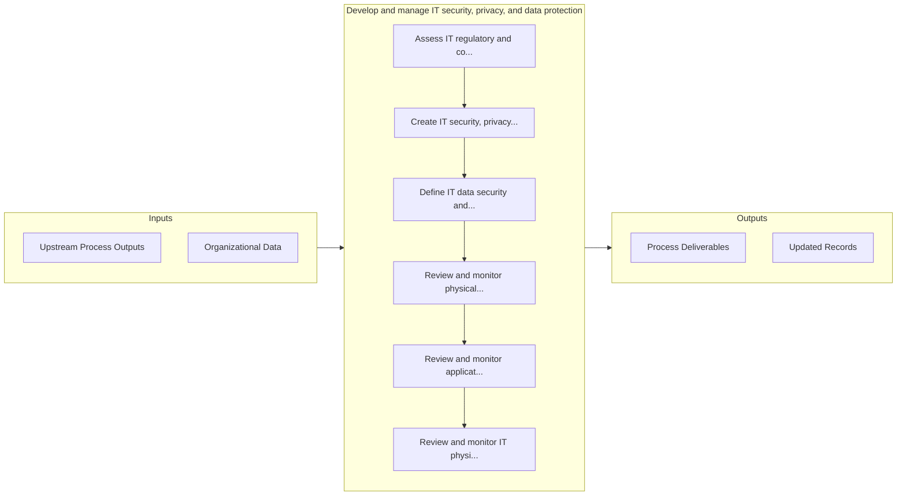

# Develop and manage IT security, privacy, and data protection

> Creating and deploying an architecture for securing and ensuring the privacy of data flows throughout the organization.

## Overview

Process 8.3.5 is a core process that defines the specific procedures for develop and manage it security, privacy, and data protection. 

Creating and deploying an architecture for securing and ensuring the privacy of data flows throughout the organization. Create and develop protocols that ensure proper and efficient use of IT services and solutions

## Process Hierarchy



## Key Statistics

| Metric | Value |
|--------|-------|
| APQC Code | 20735 |
| Hierarchy ID | 8.3.5 |
| Level | Process |
| Parent | [8.3](../) |
| Sub-Processes | 7 |


## GraphDL Semantic Structure

```graphdl
develop.AndManageITSecurityPrivacyAndDataProtection
```

| Component | Value | Description |
|-----------|-------|-------------|
| Verb | `develop` | Primary action |
| Object | `and manage IT security, privacy, and data protection` | Direct object |


## Process Flow



## Sub-Processes

| Process | Hierarchy ID | Description |
|---------|-------------|-------------|
| [Assess IT regulatory and confidentiality requirements and policies](./AssessITRegulatoryAndConfidentialityRequirementsAndPolicies) | 8.3.5.1 | Evaluate principles or rules employed in controlling, directing, or managing IT services |
| [Create IT security, privacy, and data protection risk governance](./CreateITSecurityPrivacyAndDataProtectionRiskGovernance) | 8.3.5.2 | Defining and managing organization's approach to governing IT security and ensuring the privacy of d |
| [Define IT data security and privacy policies, standards, and procedures](./DefineITDataSecurityAndPrivacyPoliciesStandardsAndProcedures) | 8.3.5.3 | Outlining and establishing policies, regulations, standards, and procedures for IT data security and |
| [Review and monitor physical and logical IT data security measures](./ReviewAndMonitorPhysicalAndLogicalITDataSecurityMeasures) | 8.3.5.4 | Identifying, examining, and reviewing physical and logical IT data security measures such as hardwar |
| [Review and monitor application security controls](./ReviewAndMonitorApplicationSecurityControls) | 8.3.5.5 | Identifying, examining, and reviewing security control for IT applications |
| [Review and monitor IT physical environment security controls](./ReviewAndMonitorITPhysicalEnvironmentSecurityControls) | 8.3.5.6 | Identifying and examining security controls for physical environment of information technology such  |
| [Monitor/analyze network intrusion detection data and resolve threats](./MonitoranalyzeNetworkIntrusionDetectionDataAndResolveThreats) | 8.3.5.7 | Monitoring and evaluating network intrusion detection for any malicious activity or policy violation |


## Related Concepts

- ITSecurity
- Privacy
- DataProtection
- ITSecurity
- Privacy
- DataProtection


---

*Source: APQC PCF 20735 (8.3.5) - APQC*
