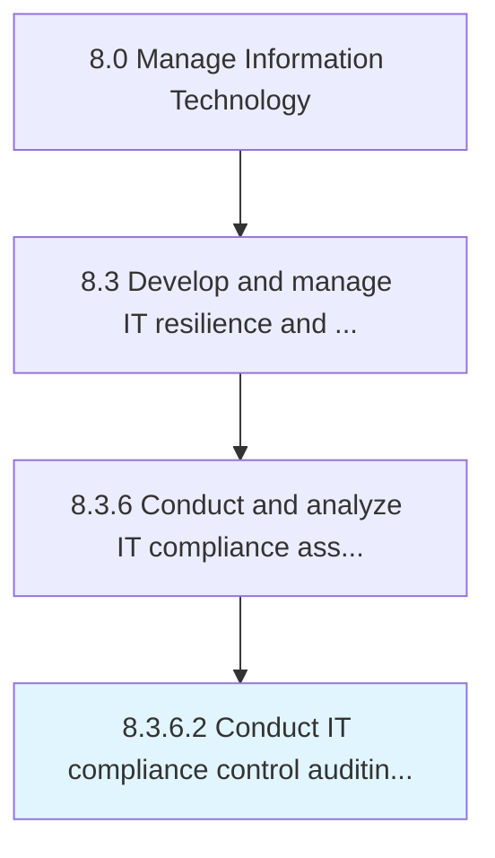

# Conduct IT compliance control auditing of internal and external services

> Examine compliance control systems and tools implemented for internal and external IT services.

## Overview

Activity 8.3.6.2 is an activity within the Manage Information Technology framework. 

Examine compliance control systems and tools implemented for internal and external IT services.

## Process Hierarchy



## Key Statistics

| Metric | Value |
|--------|-------|
| APQC Code | 20745 |
| Hierarchy ID | 8.3.6.2 |
| Level | Activity |
| Parent | [8.3.6](../) |
| Sub-Processes | 0 |


## GraphDL Semantic Structure

```
conduct.ITComplianceControlAuditing.of.InternalAndExternalServices
```

| Component | Value | Description |
|-----------|-------|-------------|
| Verb | `conduct` | Primary action |
| Object | `IT compliance control auditing` | Direct object |
| Preposition | `of` | Relationship |
| PrepObject | `internal and external services` | Indirect object |


## Related Concepts

- ITComplianceControlAuditing
- InternalServices
- ITComplianceControlAuditing
- ExternalServices


---

*Source: APQC PCF 20745 (8.3.6.2) - APQC*
