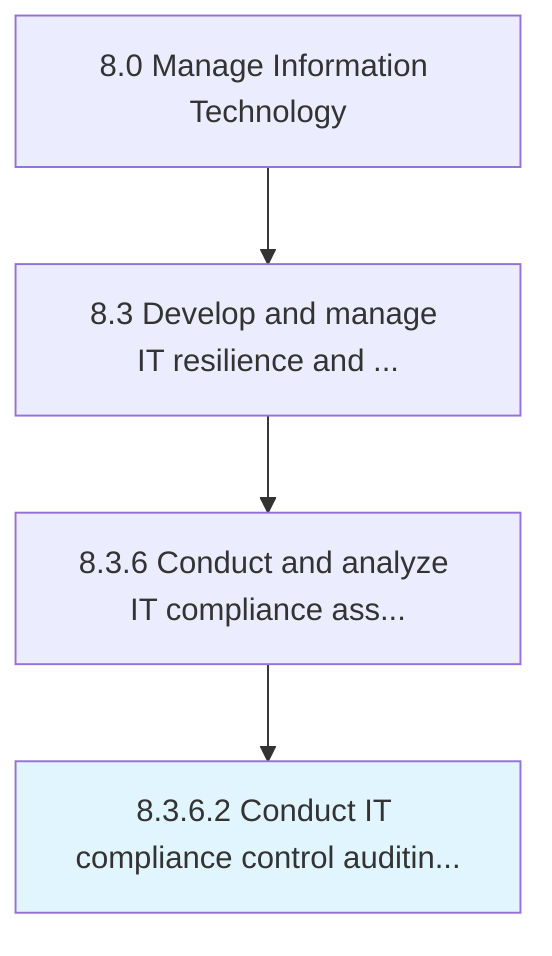
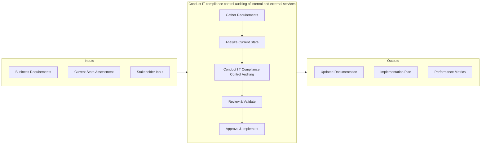
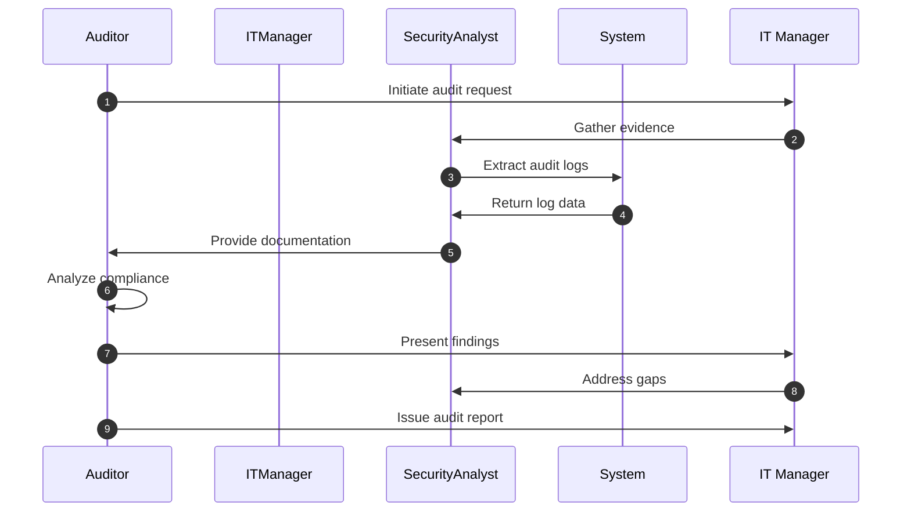

# Conduct IT compliance control auditing of internal and external services

> Examine compliance control systems and tools implemented for internal and external IT services.

## Overview

Activity 8.3.6.2 focuses on the process of conduct it compliance control auditing of internal and external services within the Manage Information Technology framework. This activity is critical for ensuring that IT operations align with organizational objectives and deliver measurable value. Examine compliance control systems and tools implemented for internal and external IT services. The process involves systematic planning, execution, and monitoring to ensure consistent quality outcomes. Effective implementation requires cross-functional collaboration between IT teams and business stakeholders, with clear governance structures and defined success criteria. Organizations that excel at this process typically demonstrate stronger IT-business alignment, reduced operational risks, and improved service delivery performance.

## Process Hierarchy



## Key Statistics

| Metric | Value |
|--------|-------|
| APQC Code | 20745 |
| Hierarchy ID | 8.3.6.2 |
| Level | Activity |
| Parent | [8.3.6](../) |
| Sub-Processes | 0 |

## Process Flow



## Process Sequence



## GraphDL Semantic Structure

```graphdl
conduct.ITComplianceControlAuditing.of.InternalAndExternalServices
```

| Component | Value | Description |
|-----------|-------|-------------|
| Verb | `conduct` | Primary action |
| Object | `IT compliance control auditing` | Direct object |
| Preposition | `of` | Relationship |
| PrepObject | `internal and external services` | Indirect object |

## Related Concepts

- ITComplianceControlAuditing
- InternalServices
- ITComplianceControlAuditing
- ExternalServices

## RACI Matrix

| Activity | Responsible | Accountable | Consulted | Informed |
|----------|-------------|-------------|-----------|----------|
| Conduct IT compliance control auditing of internal and external services | IT Security Manager | CIO | Risk Analyst | All IT Staff |
| Review & Approve | IT Director | CIO | Compliance Officer | Executive Team |
| Document & Report | IT Analyst | IT Manager | Quality Assurance | Stakeholders |

## Related Occupations

- [IT Security Manager](/occupations/Technology/InformationSecurityAnalysts) - Oversees security and resilience programs
- [Disaster Recovery Specialist](/occupations/Technology/ComputerNetworkArchitects) - Plans and tests disaster recovery procedures
- [Business Continuity Planner](/occupations/Management/EmergencyManagementDirectors) - Develops continuity strategies
- [Risk Analyst](/occupations/Business/FinancialRiskSpecialists) - Assesses and mitigates IT risks

## Related Departments

- IT Security - Manages cybersecurity and resilience
- Risk Management - Coordinates enterprise risk programs
- Compliance - Ensures regulatory adherence

## Industry Variations

### Financial Services

In banking and insurance, this process emphasizes regulatory compliance, data privacy requirements, and integration with legacy core systems. Activities include SOX compliance checks, PCI-DSS adherence, and alignment with financial regulatory frameworks.

**Industry-Specific Considerations:**
- Regulatory audit trail requirements
- Data encryption and privacy mandates
- Integration with core banking/insurance platforms

### Healthcare

Healthcare organizations adapt this process to meet HIPAA requirements, electronic health record (EHR) system demands, and clinical workflow integration. Patient data security and interoperability standards (HL7/FHIR) are central concerns.

**Industry-Specific Considerations:**
- HIPAA compliance and patient data protection
- EHR system integration requirements
- Clinical workflow optimization

### Technology / Software

Technology companies typically execute this process with agile methodologies, continuous delivery pipelines, and cloud-native architectures. Emphasis is on rapid iteration, DevOps practices, and scalable infrastructure.

**Industry-Specific Considerations:**
- Agile and DevOps integration
- Cloud-first architecture patterns
- Continuous integration/continuous deployment (CI/CD)

## KPIs & Metrics

| Metric | Description | Target |
|--------|-------------|--------|
| Process Cycle Time | Average time to complete the conduct process end-to-end | < 5 business days |
| Stakeholder Satisfaction | Satisfaction score from internal stakeholders | > 4.0 / 5.0 |
| Compliance Rate | Percentage of activities meeting policy requirements | > 95% |
| Cost Efficiency | Cost per process execution relative to budget | Within 10% of budget |
| First-Time Quality Rate | Percentage of deliverables accepted without rework | > 90% |

---

*Source: APQC PCF 20745 (8.3.6.2) - APQC*
