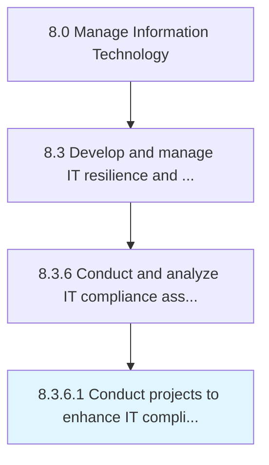

# Conduct projects to enhance IT compliance and remediate risk

> Conducting projects in order to enhance set standards, established guidelines, and risk preventive measures for IT risk and resilience.

## Overview

Activity 8.3.6.1 is an activity within the Manage Information Technology framework. 

Conducting projects in order to enhance set standards, established guidelines, and risk preventive measures for IT risk and resilience.

## Process Hierarchy



## Key Statistics

| Metric | Value |
|--------|-------|
| APQC Code | 20744 |
| Hierarchy ID | 8.3.6.1 |
| Level | Activity |
| Parent | [8.3.6](../) |
| Sub-Processes | 0 |


## GraphDL Semantic Structure

```
conduct.Projects.to.EnhanceITComplianceAndRemediateRisk
```

| Component | Value | Description |
|-----------|-------|-------------|
| Verb | `conduct` | Primary action |
| Object | `projects` | Direct object |
| Preposition | `to` | Relationship |
| PrepObject | `enhance IT compliance and remediate risk` | Indirect object |


## Related Concepts

- Projects
- EnhanceITCompliance
- Projects
- RemediateRisk


---

*Source: APQC PCF 20744 (8.3.6.1) - APQC*
