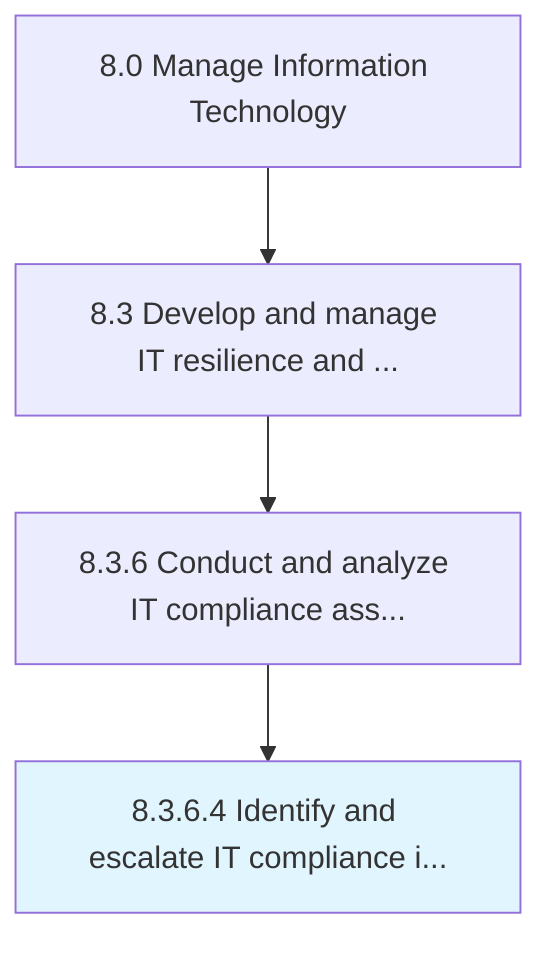

# Identify and escalate IT compliance issues and remediation requirements

> Identify and escalate issues related to IT compliance to ensure that corrective measures are taken.

## Overview

Activity 8.3.6.4 is an activity within the Manage Information Technology framework. 

Identify and escalate issues related to IT compliance to ensure that corrective measures are taken.

## Process Hierarchy



## Key Statistics

| Metric | Value |
|--------|-------|
| APQC Code | 20747 |
| Hierarchy ID | 8.3.6.4 |
| Level | Activity |
| Parent | [8.3.6](../) |
| Sub-Processes | 0 |


## GraphDL Semantic Structure

```
identify.AndEscalateITComplianceIssuesAndRemediationRequirements
```

| Component | Value | Description |
|-----------|-------|-------------|
| Verb | `identify` | Primary action |
| Object | `and escalate IT compliance issues and remediation requirements` | Direct object |


## Related Concepts

- ITComplianceIssuesRequirements
- RemediationRequirements
- ITComplianceIssuesRequirements
- RemediationRequirements


---

*Source: APQC PCF 20747 (8.3.6.4) - APQC*
