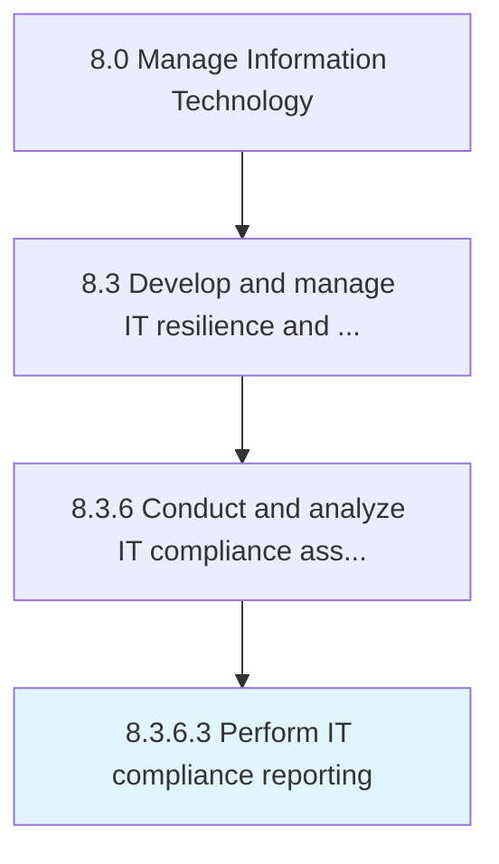

# Perform IT compliance reporting

> Execute IT compliance reporting in order to review processes, standards, regulations, and laws are followed as laid out by the regulatory bodies.

## Overview

Activity 8.3.6.3 is an activity within the Manage Information Technology framework. 

Execute IT compliance reporting in order to review processes, standards, regulations, and laws are followed as laid out by the regulatory bodies.

## Process Hierarchy



## Key Statistics

| Metric | Value |
|--------|-------|
| APQC Code | 20746 |
| Hierarchy ID | 8.3.6.3 |
| Level | Activity |
| Parent | [8.3.6](../) |
| Sub-Processes | 0 |


## GraphDL Semantic Structure

```
perform.ITComplianceReporting
```

| Component | Value | Description |
|-----------|-------|-------------|
| Verb | `perform` | Primary action |
| Object | `IT compliance reporting` | Direct object |


## Related Concepts

- ITComplianceReporting


---

*Source: APQC PCF 20746 (8.3.6.3) - APQC*
