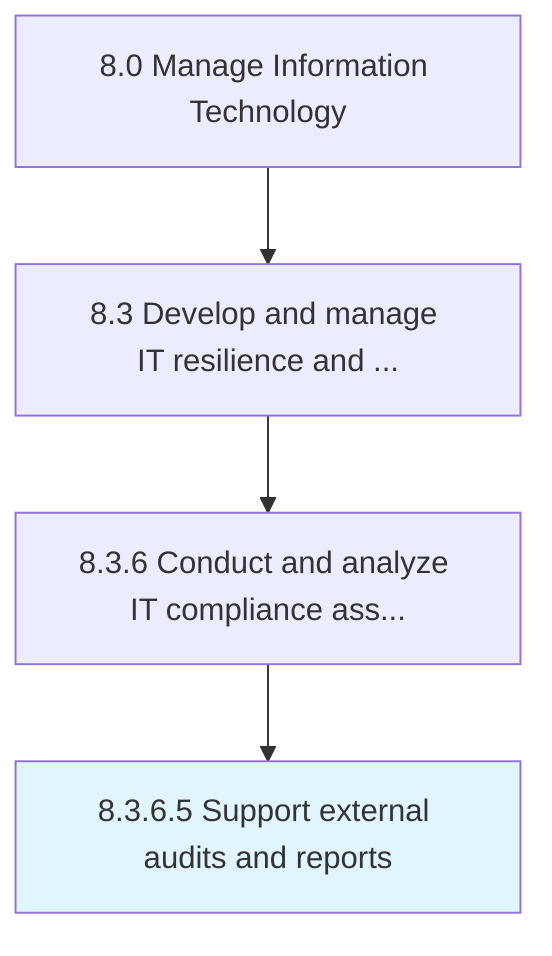

# Support external audits and reports

> Supporting audits and reports through external resources.

## Overview

Activity 8.3.6.5 is an activity within the Manage Information Technology framework. 

Supporting audits and reports through external resources. This process requires the organization to follow all the regulations set forth by external auditors.

## Process Hierarchy



## Key Statistics

| Metric | Value |
|--------|-------|
| APQC Code | 20748 |
| Hierarchy ID | 8.3.6.5 |
| Level | Activity |
| Parent | [8.3.6](../) |
| Sub-Processes | 0 |


## GraphDL Semantic Structure

```
support.ExternalAuditsAndReports
```

| Component | Value | Description |
|-----------|-------|-------------|
| Verb | `support` | Primary action |
| Object | `external audits and reports` | Direct object |


## Related Concepts

- ExternalAudits
- Reports


---

*Source: APQC PCF 20748 (8.3.6.5) - APQC*
