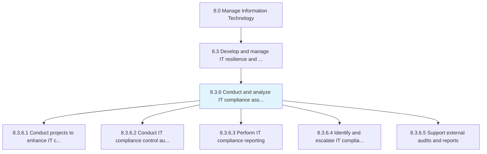
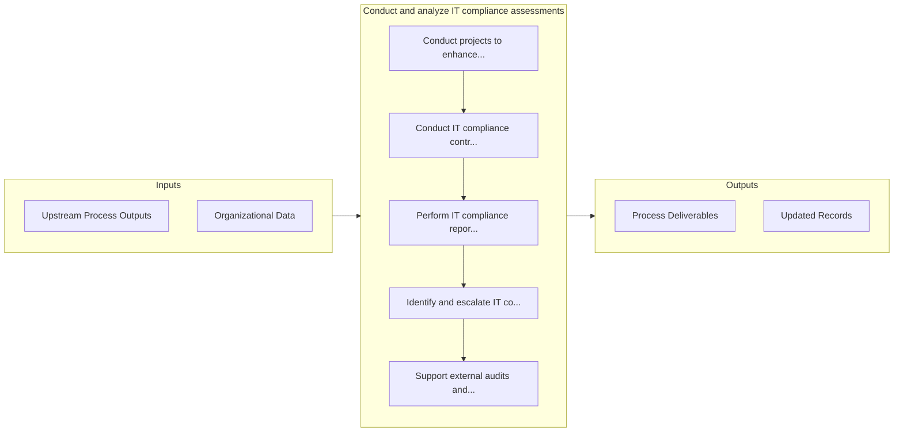

# Conduct and analyze IT compliance assessments

> Evaluate and analyze the IT environment for the compliance of industry regulations and government legislation.

## Overview

Process 8.3.6 is a core process that defines the specific procedures for conduct and analyze it compliance assessments. 

Evaluate and analyze the IT environment for the compliance of industry regulations and government legislation. Ensure that IT capability and resources meet the set standards.

## Process Hierarchy



## Key Statistics

| Metric | Value |
|--------|-------|
| APQC Code | 20743 |
| Hierarchy ID | 8.3.6 |
| Level | Process |
| Parent | [8.3](../) |
| Sub-Processes | 5 |


## GraphDL Semantic Structure

```
conduct.AndAnalyzeITComplianceAssessments
```

| Component | Value | Description |
|-----------|-------|-------------|
| Verb | `conduct` | Primary action |
| Object | `and analyze IT compliance assessments` | Direct object |


## Process Flow



## Sub-Processes

| Process | Hierarchy ID | Description |
|---------|-------------|-------------|
| [Conduct projects to enhance IT compliance and remediate risk](./ConductProjectsToEnhanceITComplianceAndRemediateRisk) | 8.3.6.1 | Conducting projects in order to enhance set standards, established guidelines, and risk preventive m |
| [Conduct IT compliance control auditing of internal and external services](./ConductITComplianceControlAuditingOfInternalAndExternalServices) | 8.3.6.2 | Examine compliance control systems and tools implemented for internal and external IT services |
| [Perform IT compliance reporting](./PerformITComplianceReporting) | 8.3.6.3 | Execute IT compliance reporting in order to review processes, standards, regulations, and laws are f |
| [Identify and escalate IT compliance issues and remediation requirements](./IdentifyAndEscalateITComplianceIssuesAndRemediationRequirements) | 8.3.6.4 | Identify and escalate issues related to IT compliance to ensure that corrective measures are taken |
| [Support external audits and reports](./SupportExternalAuditsAndReports) | 8.3.6.5 | Supporting audits and reports through external resources |


## Related Concepts

- [ITComplianceAssessments](/concepts/ITComplianceAssessments)
- [ITComplianceAssessments](/concepts/ITComplianceAssessments)


---

*Source: APQC PCF 20743 (8.3.6) - APQC*
