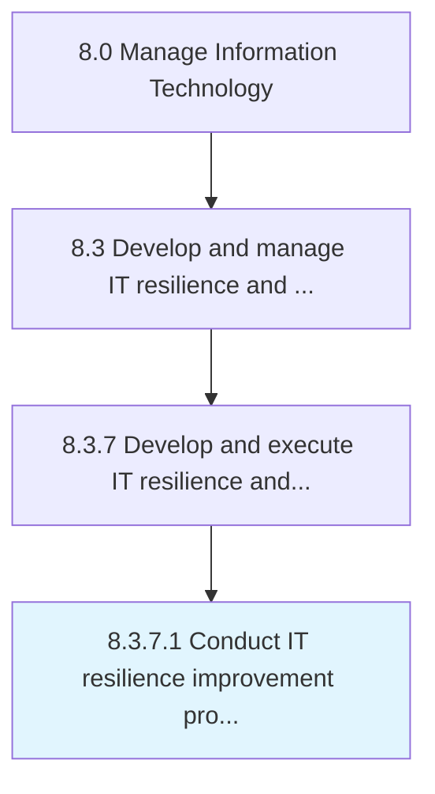

# Conduct IT resilience improvement projects

> Conducting projects to improve the strategy and process for rapidly adapting to any threat in IT.

## Overview

Activity 8.3.7.1 is an activity within the Manage Information Technology framework. 

Conducting projects to improve the strategy and process for rapidly adapting to any threat in IT.

## Process Hierarchy



## Key Statistics

| Metric | Value |
|--------|-------|
| APQC Code | 20750 |
| Hierarchy ID | 8.3.7.1 |
| Level | Activity |
| Parent | [8.3.7](../) |
| Sub-Processes | 0 |


## GraphDL Semantic Structure

```
conduct.ITResilienceImprovementProjects
```

| Component | Value | Description |
|-----------|-------|-------------|
| Verb | `conduct` | Primary action |
| Object | `IT resilience improvement projects` | Direct object |


## Related Concepts

- [ITResilienceImprovementProjects](/concepts/ITResilienceImprovementProjects)


---

*Source: APQC PCF 20750 (8.3.7.1) - APQC*
