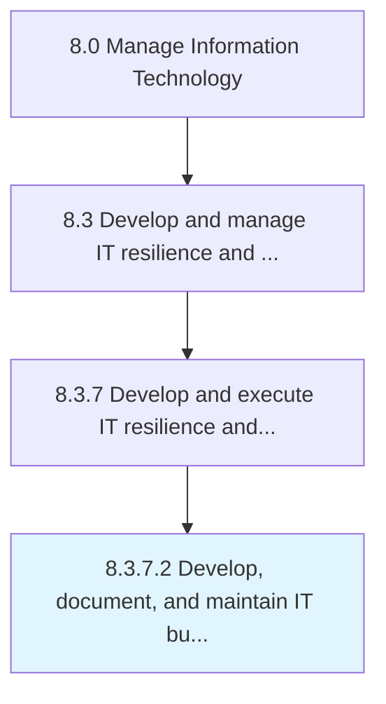

# Develop, document, and maintain IT business continuity planning

> Develop, document, and maintain plans to ensure uninterrupted operations of critical IT services.

## Overview

Activity 8.3.7.2 is an activity within the Manage Information Technology framework. 

Develop, document, and maintain plans to ensure uninterrupted operations of critical IT services. Determine resources such as specialized personnel, equipment, support infrastructure, legal and financial aspects.

## Process Hierarchy



## Key Statistics

| Metric | Value |
|--------|-------|
| APQC Code | 20751 |
| Hierarchy ID | 8.3.7.2 |
| Level | Activity |
| Parent | [8.3.7](../) |
| Sub-Processes | 0 |


## GraphDL Semantic Structure

```
develop,.DocumentAndMaintainITBusinessContinuityPlanning
```

| Component | Value | Description |
|-----------|-------|-------------|
| Verb | `develop,` | Primary action |
| Object | `document, and maintain IT business continuity planning` | Direct object |


## Related Concepts

- [ITBusinessContinuityPlanning](/concepts/ITBusinessContinuityPlanning)
- [ITBusinessContinuityPlanning](/concepts/ITBusinessContinuityPlanning)
- [ITBusinessContinuityPlanning](/concepts/ITBusinessContinuityPlanning)


---

*Source: APQC PCF 20751 (8.3.7.2) - APQC*
