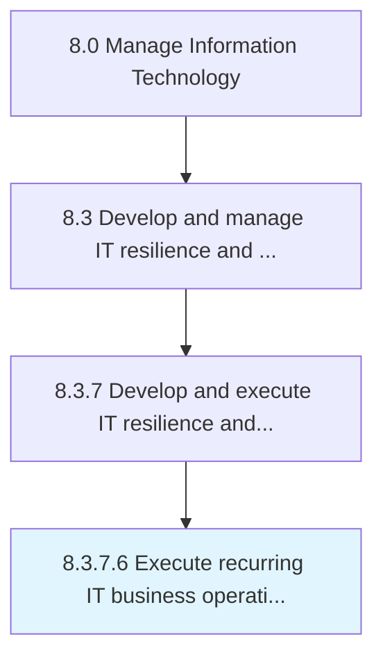

# Execute recurring IT business operations continuity

> Implement regular resources supporting uninterrupted operations of critical IT services.

## Overview

Activity 8.3.7.6 is an activity within the Manage Information Technology framework. 

Implement regular resources supporting uninterrupted operations of critical IT services.

## Process Hierarchy



## Key Statistics

| Metric | Value |
|--------|-------|
| APQC Code | 20755 |
| Hierarchy ID | 8.3.7.6 |
| Level | Activity |
| Parent | [8.3.7](../) |
| Sub-Processes | 0 |


## GraphDL Semantic Structure

```
execute.RecurringITBusinessOperationsContinuity
```

| Component | Value | Description |
|-----------|-------|-------------|
| Verb | `execute` | Primary action |
| Object | `recurring IT business operations continuity` | Direct object |


## Related Concepts

- [RecurringITBusinessOperationsContinuity](/concepts/RecurringITBusinessOperationsContinuity)


---

*Source: APQC PCF 20755 (8.3.7.6) - APQC*
