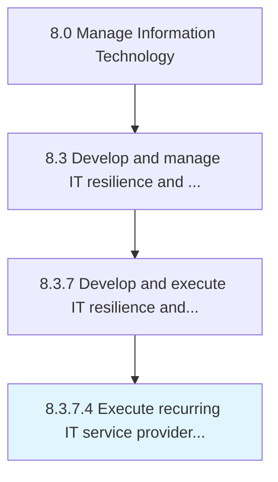

# Execute recurring IT service provider business continuity

> Review and implement resources (including external parties) necessary to support uninterrupted operations of critical IT services.

## Overview

Activity 8.3.7.4 is an activity within the Manage Information Technology framework. 

Review and implement resources (including external parties) necessary to support uninterrupted operations of critical IT services.

## Process Hierarchy



## Key Statistics

| Metric | Value |
|--------|-------|
| APQC Code | 20753 |
| Hierarchy ID | 8.3.7.4 |
| Level | Activity |
| Parent | [8.3.7](../) |
| Sub-Processes | 0 |


## GraphDL Semantic Structure

```
execute.RecurringITServiceProviderBusinessContinuity
```

| Component | Value | Description |
|-----------|-------|-------------|
| Verb | `execute` | Primary action |
| Object | `recurring IT service provider business continuity` | Direct object |


## Related Concepts

- [RecurringITServiceProviderBusinessContinuity](/concepts/RecurringITServiceProviderBusinessContinuity)


---

*Source: APQC PCF 20753 (8.3.7.4) - APQC*
