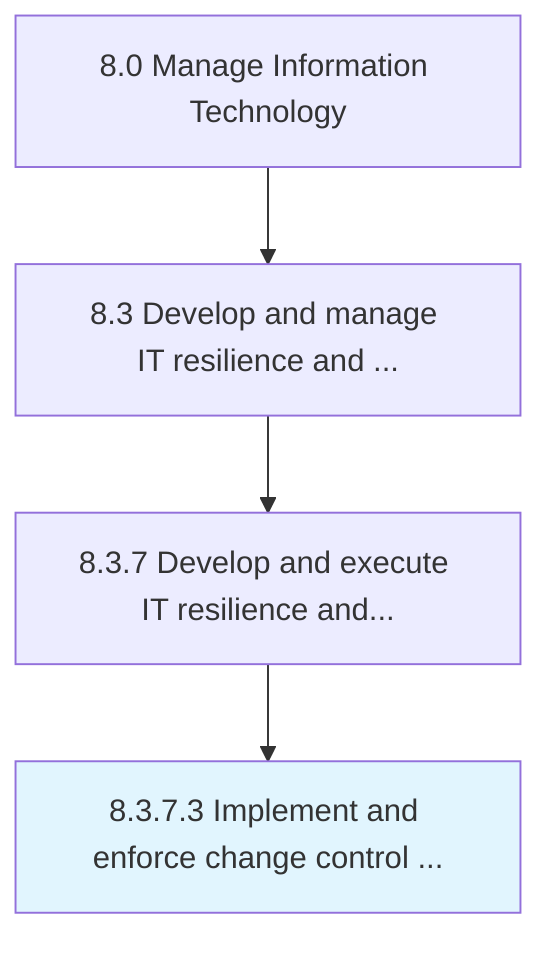

# Implement and enforce change control procedures

> Implement and enforce procedures and policies in order to control changes in IT services and solutions.

## Overview

Activity 8.3.7.3 is an activity within the Manage Information Technology framework. 

Implement and enforce procedures and policies in order to control changes in IT services and solutions. Manage changes in a rational and predictable manner for optimum resource utilization.

## Process Hierarchy



## Key Statistics

| Metric | Value |
|--------|-------|
| APQC Code | 20752 |
| Hierarchy ID | 8.3.7.3 |
| Level | Activity |
| Parent | [8.3.7](../) |
| Sub-Processes | 0 |


## GraphDL Semantic Structure

```
implement.AndEnforceChangeControlProcedures
```

| Component | Value | Description |
|-----------|-------|-------------|
| Verb | `implement` | Primary action |
| Object | `and enforce change control procedures` | Direct object |


## Related Concepts

- ChangeControlProcedures
- ChangeControlProcedures


---

*Source: APQC PCF 20752 (8.3.7.3) - APQC*
