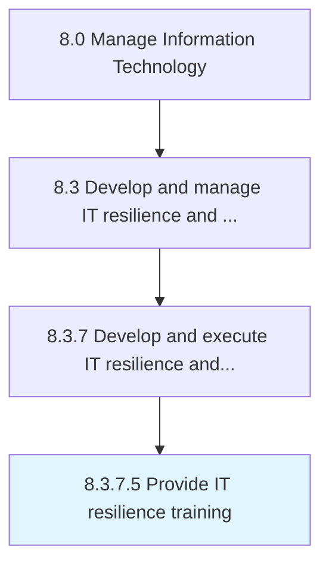

# Provide IT resilience training

> Conduct and manage employee training programs on IT resilience so that prospective risks can be avoided.

## Overview

Activity 8.3.7.5 is an activity within the Manage Information Technology framework. 

Conduct and manage employee training programs on IT resilience so that prospective risks can be avoided.

## Process Hierarchy



## Key Statistics

| Metric | Value |
|--------|-------|
| APQC Code | 20754 |
| Hierarchy ID | 8.3.7.5 |
| Level | Activity |
| Parent | [8.3.7](../) |
| Sub-Processes | 0 |


## GraphDL Semantic Structure

```
provide.ITResilienceTraining
```

| Component | Value | Description |
|-----------|-------|-------------|
| Verb | `provide` | Primary action |
| Object | `IT resilience training` | Direct object |


## Related Concepts

- ITResilienceTraining


---

*Source: APQC PCF 20754 (8.3.7.5) - APQC*
