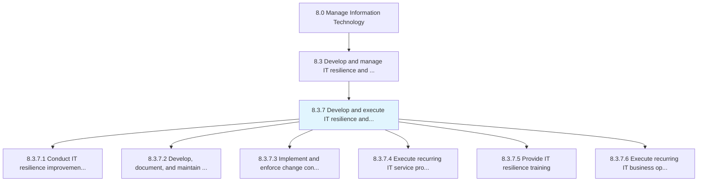
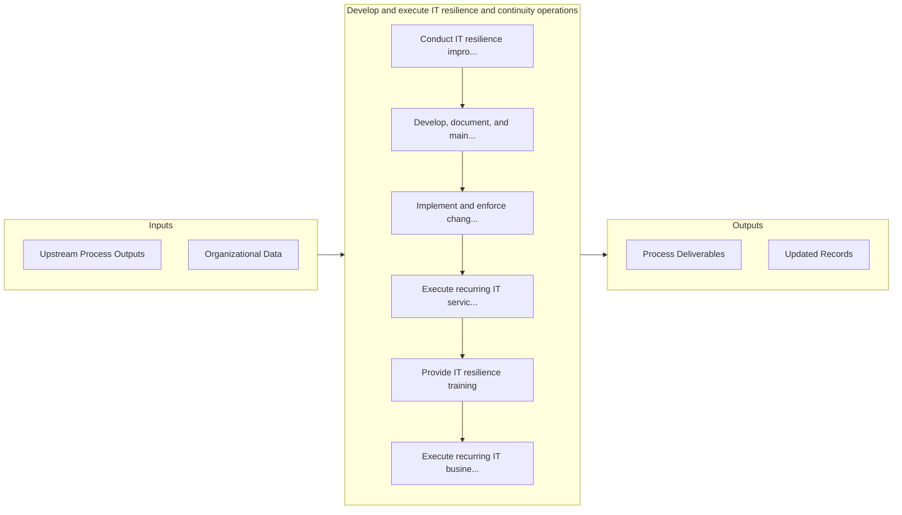

# Develop and execute IT resilience and continuity operations

> Create and execute a process to rapidly adapt and respond to any internal or external opportunity, demand, disruption, or threat in IT.

## Overview

Process 8.3.7 is a core process that defines the specific procedures for develop and execute it resilience and continuity operations. 

Create and execute a process to rapidly adapt and respond to any internal or external opportunity, demand, disruption, or threat in IT. Maintain continuous IT operations to protect employees, assets, and overall brand equity.

## Process Hierarchy



## Key Statistics

| Metric | Value |
|--------|-------|
| APQC Code | 20749 |
| Hierarchy ID | 8.3.7 |
| Level | Process |
| Parent | [8.3](../) |
| Sub-Processes | 6 |


## GraphDL Semantic Structure

```
develop.AndExecuteITResilienceAndContinuityOperations
```

| Component | Value | Description |
|-----------|-------|-------------|
| Verb | `develop` | Primary action |
| Object | `and execute IT resilience and continuity operations` | Direct object |


## Process Flow



## Sub-Processes

| Process | Hierarchy ID | Description |
|---------|-------------|-------------|
| [Conduct IT resilience improvement projects](./ConductITResilienceImprovementProjects) | 8.3.7.1 | Conducting projects to improve the strategy and process for rapidly adapting to any threat in IT |
| [Develop, document, and maintain IT business continuity planning](./DevelopDocumentAndMaintainITBusinessContinuityPlanning) | 8.3.7.2 | Develop, document, and maintain plans to ensure uninterrupted operations of critical IT services |
| [Implement and enforce change control procedures](./ImplementAndEnforceChangeControlProcedures) | 8.3.7.3 | Implement and enforce procedures and policies in order to control changes in IT services and solutio |
| [Execute recurring IT service provider business continuity](./ExecuteRecurringITServiceProviderBusinessContinuity) | 8.3.7.4 | Review and implement resources (including external parties) necessary to support uninterrupted opera |
| [Provide IT resilience training](./ProvideITResilienceTraining) | 8.3.7.5 | Conduct and manage employee training programs on IT resilience so that prospective risks can be avoi |
| [Execute recurring IT business operations continuity](./ExecuteRecurringITBusinessOperationsContinuity) | 8.3.7.6 | Implement regular resources supporting uninterrupted operations of critical IT services |


## Related Concepts

- [ITResilienceOperations](/concepts/ITResilienceOperations)
- [ContinuityOperations](/concepts/ContinuityOperations)
- [ITResilienceOperations](/concepts/ITResilienceOperations)
- [ContinuityOperations](/concepts/ContinuityOperations)


---

*Source: APQC PCF 20749 (8.3.7) - APQC*
