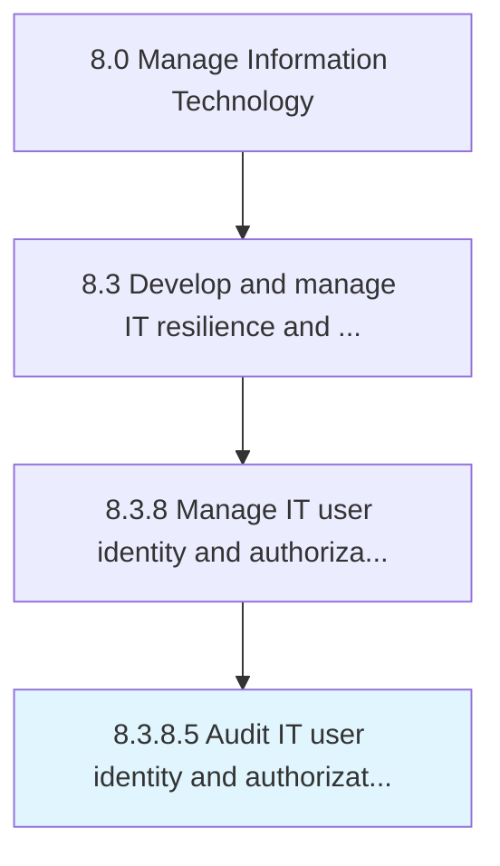

# Audit IT user identity and authorization systems

> Examine the processes responsible for reviewing IT user identity and authorization.

## Overview

Activity 8.3.8.5 is an activity within the Manage Information Technology framework. 

Examine the processes responsible for reviewing IT user identity and authorization.

## Process Hierarchy



## Key Statistics

| Metric | Value |
|--------|-------|
| APQC Code | 20761 |
| Hierarchy ID | 8.3.8.5 |
| Level | Activity |
| Parent | [8.3.8](../) |
| Sub-Processes | 0 |


## GraphDL Semantic Structure

```
audit.ITUserIdentityAndAuthorizationSystems
```

| Component | Value | Description |
|-----------|-------|-------------|
| Verb | `audit` | Primary action |
| Object | `IT user identity and authorization systems` | Direct object |


## Related Concepts

- ITUserIdentitySystems
- AuthorizationSystems


---

*Source: APQC PCF 20761 (8.3.8.5) - APQC*
