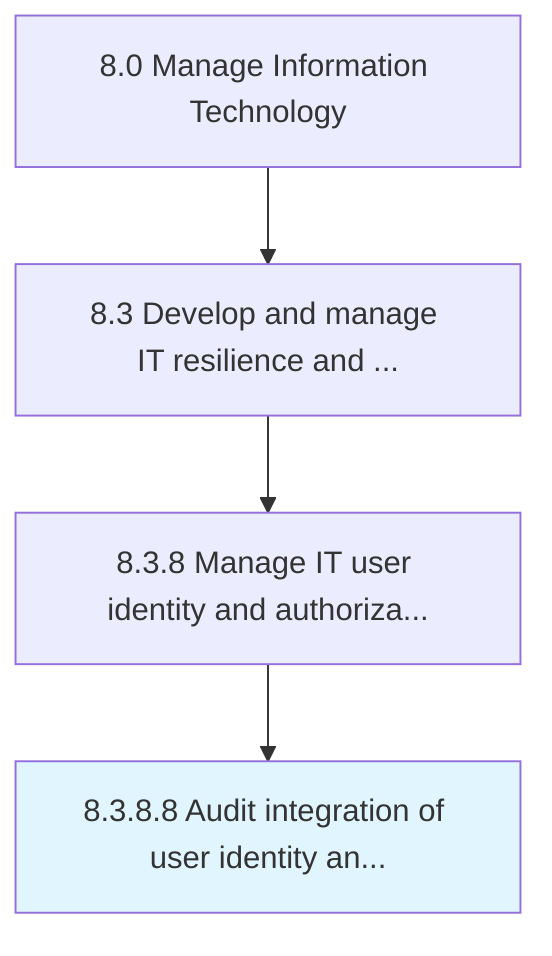

# Audit integration of user identity and authorization systems

> Reviewing the processes responsible for integration of user identity and access authorization in order to confirm that all the required regulations are followed.

## Overview

Activity 8.3.8.8 is an activity within the Manage Information Technology framework. 

Reviewing the processes responsible for integration of user identity and access authorization in order to confirm that all the required regulations are followed.

## Process Hierarchy



## Key Statistics

| Metric | Value |
|--------|-------|
| APQC Code | 20764 |
| Hierarchy ID | 8.3.8.8 |
| Level | Activity |
| Parent | [8.3.8](../) |
| Sub-Processes | 0 |


## GraphDL Semantic Structure

```
audit.Integration.of.UserIdentityAndAuthorizationSystems
```

| Component | Value | Description |
|-----------|-------|-------------|
| Verb | `audit` | Primary action |
| Object | `integration` | Direct object |
| Preposition | `of` | Relationship |
| PrepObject | `user identity and authorization systems` | Indirect object |


## Related Concepts

- [Integration](/concepts/Integration)
- [UserIdentitySystems](/concepts/UserIdentitySystems)
- [Integration](/concepts/Integration)
- [AuthorizationSystems](/concepts/AuthorizationSystems)


---

*Source: APQC PCF 20764 (8.3.8.8) - APQC*
