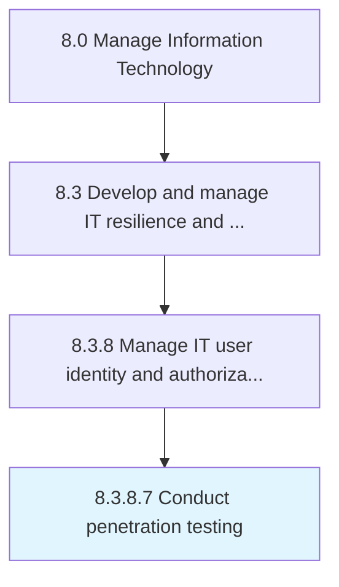

# Conduct penetration testing

> Conduct penetration testing (pen test) through an authorized stimulated attack to identify security weakness in an IT environment by evaluating the system or network with various harmful techniques.

## Overview

Activity 8.3.8.7 is an activity within the Manage Information Technology framework. 

Conduct penetration testing (pen test) through an authorized stimulated attack to identify security weakness in an IT environment by evaluating the system or network with various harmful techniques.

## Process Hierarchy



## Key Statistics

| Metric | Value |
|--------|-------|
| APQC Code | 20763 |
| Hierarchy ID | 8.3.8.7 |
| Level | Activity |
| Parent | [8.3.8](../) |
| Sub-Processes | 0 |


## GraphDL Semantic Structure

```
conduct.PenetrationTesting
```

| Component | Value | Description |
|-----------|-------|-------------|
| Verb | `conduct` | Primary action |
| Object | `penetration testing` | Direct object |


## Related Concepts

- PenetrationTesting


---

*Source: APQC PCF 20763 (8.3.8.7) - APQC*
