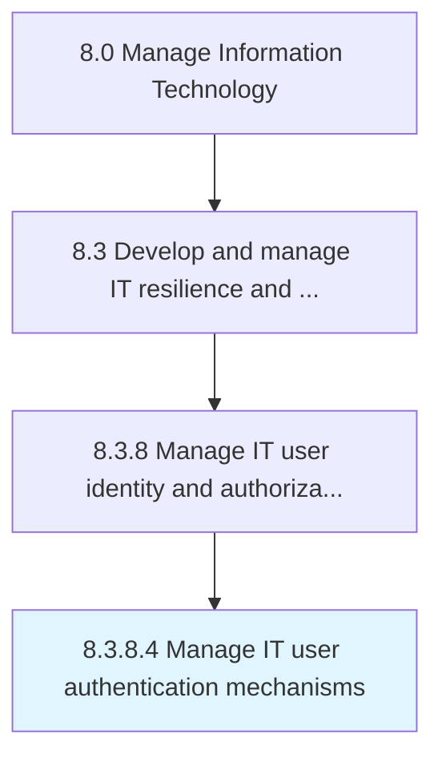

# Manage IT user authentication mechanisms

> Create and manage the process to authenticate IT users from user directory based on the internal policies.

## Overview

Activity 8.3.8.4 is an activity within the Manage Information Technology framework. 

Create and manage the process to authenticate IT users from user directory based on the internal policies.

## Process Hierarchy



## Key Statistics

| Metric | Value |
|--------|-------|
| APQC Code | 20760 |
| Hierarchy ID | 8.3.8.4 |
| Level | Activity |
| Parent | [8.3.8](../) |
| Sub-Processes | 0 |


## GraphDL Semantic Structure

```
manage.ITUserAuthenticationMechanisms
```

| Component | Value | Description |
|-----------|-------|-------------|
| Verb | `manage` | Primary action |
| Object | `IT user authentication mechanisms` | Direct object |


## Related Concepts

- ITUserAuthenticationMechanisms


---

*Source: APQC PCF 20760 (8.3.8.4) - APQC*
