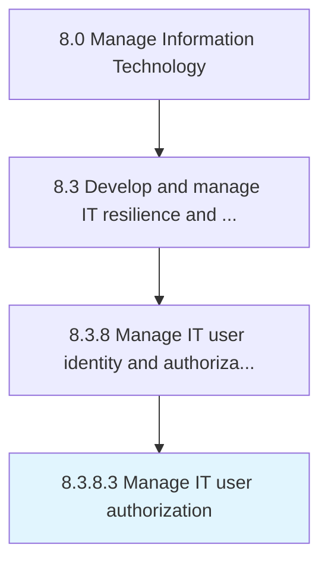

# Manage IT user authorization

> Managing the process of authorizing IT users to access applications, systems, IT components, or networks by associating user rights.

## Overview

Activity 8.3.8.3 is an activity within the Manage Information Technology framework. 

Managing the process of authorizing IT users to access applications, systems, IT components, or networks by associating user rights.

## Process Hierarchy



## Key Statistics

| Metric | Value |
|--------|-------|
| APQC Code | 20759 |
| Hierarchy ID | 8.3.8.3 |
| Level | Activity |
| Parent | [8.3.8](../) |
| Sub-Processes | 0 |


## GraphDL Semantic Structure

```
manage.ITUserAuthorization
```

| Component | Value | Description |
|-----------|-------|-------------|
| Verb | `manage` | Primary action |
| Object | `IT user authorization` | Direct object |


## Related Concepts

- ITUserAuthorization


---

*Source: APQC PCF 20759 (8.3.8.3) - APQC*
