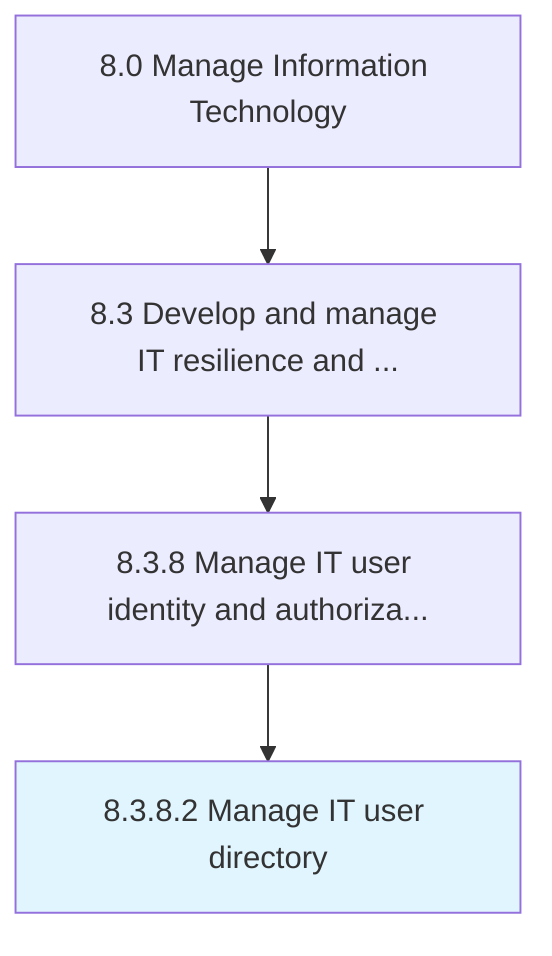

# Manage IT user directory

> Managing directory of user profiles and access requirements across different levels in the organization's IT network.

## Overview

Activity 8.3.8.2 is an activity within the Manage Information Technology framework. 

Managing directory of user profiles and access requirements across different levels in the organization's IT network.

## Process Hierarchy



## Key Statistics

| Metric | Value |
|--------|-------|
| APQC Code | 20758 |
| Hierarchy ID | 8.3.8.2 |
| Level | Activity |
| Parent | [8.3.8](../) |
| Sub-Processes | 0 |


## GraphDL Semantic Structure

```
manage.ITUserDirectory
```

| Component | Value | Description |
|-----------|-------|-------------|
| Verb | `manage` | Primary action |
| Object | `IT user directory` | Direct object |


## Related Concepts

- ITUserDirectory


---

*Source: APQC PCF 20758 (8.3.8.2) - APQC*
