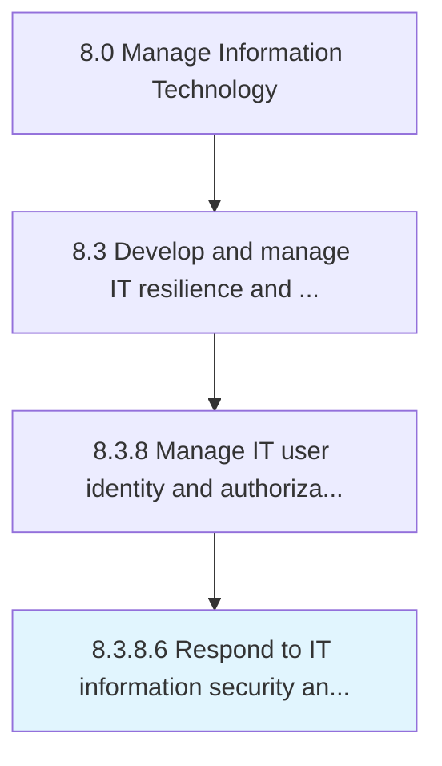

# Respond to IT information security and network breaches

> Address any form of unauthorized network breach such as unauthorized access or usage of data, applications, services, networks, and/or devices.

## Overview

Activity 8.3.8.6 is an activity within the Manage Information Technology framework. 

Address any form of unauthorized network breach such as unauthorized access or usage of data, applications, services, networks, and/or devices. Identify the root cause and take corrective measures to resolve the breach.

## Process Hierarchy



## Key Statistics

| Metric | Value |
|--------|-------|
| APQC Code | 20762 |
| Hierarchy ID | 8.3.8.6 |
| Level | Activity |
| Parent | [8.3.8](../) |
| Sub-Processes | 0 |


## GraphDL Semantic Structure

```
respond.ToITInformationSecurityAndNetworkBreaches
```

| Component | Value | Description |
|-----------|-------|-------------|
| Verb | `respond` | Primary action |
| Object | `to IT information security and network breaches` | Direct object |


## Related Concepts

- ITInformationSecurity
- NetworkBreaches


---

*Source: APQC PCF 20762 (8.3.8.6) - APQC*
