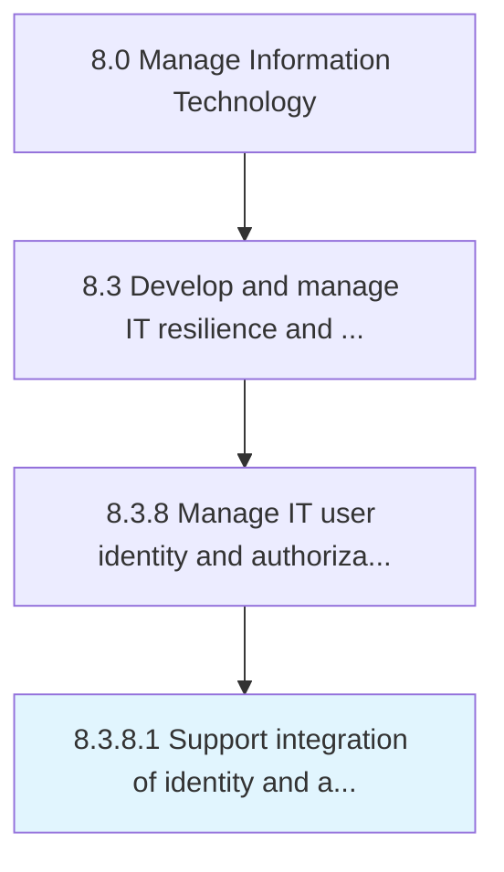

# Support integration of identity and authorization policies

> Create and implement policies that integrate authorization policies with authorized profiles of users meant to access network resources.

## Overview

Activity 8.3.8.1 is an activity within the Manage Information Technology framework. 

Create and implement policies that integrate authorization policies with authorized profiles of users meant to access network resources.

## Process Hierarchy



## Key Statistics

| Metric | Value |
|--------|-------|
| APQC Code | 20757 |
| Hierarchy ID | 8.3.8.1 |
| Level | Activity |
| Parent | [8.3.8](../) |
| Sub-Processes | 0 |


## GraphDL Semantic Structure

```
support.Integration.of.IdentityAndAuthorizationPolicies
```

| Component | Value | Description |
|-----------|-------|-------------|
| Verb | `support` | Primary action |
| Object | `integration` | Direct object |
| Preposition | `of` | Relationship |
| PrepObject | `identity and authorization policies` | Indirect object |


## Related Concepts

- Integration
- IdentityPolicies
- Integration
- AuthorizationPolicies


---

*Source: APQC PCF 20757 (8.3.8.1) - APQC*
