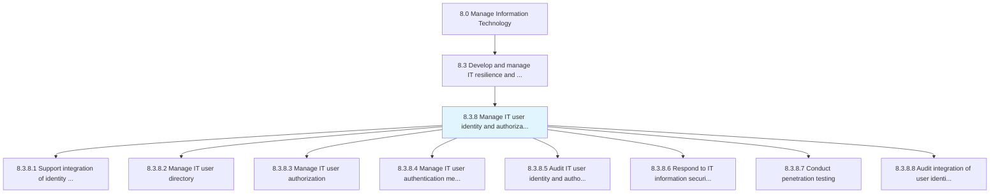
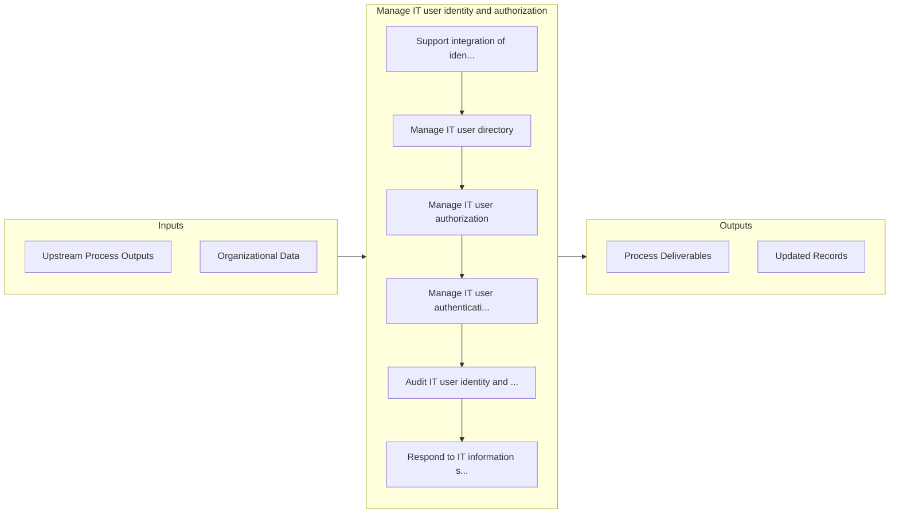

# Manage IT user identity and authorization

> The process of identifying, authenticating, and authorizing IT users to have access to applications, systems, IT components, or networks by associating user rights and restrictions with established identities.

## Overview

Process 8.3.8 is a core process that defines the specific procedures for manage it user identity and authorization. 

The process of identifying, authenticating, and authorizing IT users to have access to applications, systems, IT components, or networks by associating user rights and restrictions with established identities.

## Process Hierarchy



## Key Statistics

| Metric | Value |
|--------|-------|
| APQC Code | 20756 |
| Hierarchy ID | 8.3.8 |
| Level | Process |
| Parent | [8.3](../) |
| Sub-Processes | 8 |


## GraphDL Semantic Structure

```graphdl
manage.ITUserIdentityAndAuthorization
```

| Component | Value | Description |
|-----------|-------|-------------|
| Verb | `manage` | Primary action |
| Object | `IT user identity and authorization` | Direct object |


## Process Flow



## Sub-Processes

| Process | Hierarchy ID | Description |
|---------|-------------|-------------|
| [Support integration of identity and authorization policies](./SupportIntegrationOfIdentityAndAuthorizationPolicies) | 8.3.8.1 | Create and implement policies that integrate authorization policies with authorized profiles of user |
| [Manage IT user directory](./ManageITUserDirectory) | 8.3.8.2 | Managing directory of user profiles and access requirements across different levels in the organizat |
| [Manage IT user authorization](./ManageITUserAuthorization) | 8.3.8.3 | Managing the process of authorizing IT users to access applications, systems, IT components, or netw |
| [Manage IT user authentication mechanisms](./ManageITUserAuthenticationMechanisms) | 8.3.8.4 | Create and manage the process to authenticate IT users from user directory based on the internal pol |
| [Audit IT user identity and authorization systems](./AuditITUserIdentityAndAuthorizationSystems) | 8.3.8.5 | Examine the processes responsible for reviewing IT user identity and authorization |
| [Respond to IT information security and network breaches](./RespondToITInformationSecurityAndNetworkBreaches) | 8.3.8.6 | Address any form of unauthorized network breach such as unauthorized access or usage of data, applic |
| [Conduct penetration testing](./ConductPenetrationTesting) | 8.3.8.7 | Conduct penetration testing (pen test) through an authorized stimulated attack to identify security  |
| [Audit integration of user identity and authorization systems](./AuditIntegrationOfUserIdentityAndAuthorizationSystems) | 8.3.8.8 | Reviewing the processes responsible for integration of user identity and access authorization in ord |


## Related Concepts

- ITUserIdentity
- Authorization


---

*Source: APQC PCF 20756 (8.3.8) - APQC*
