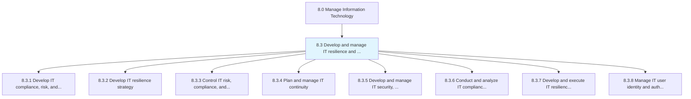
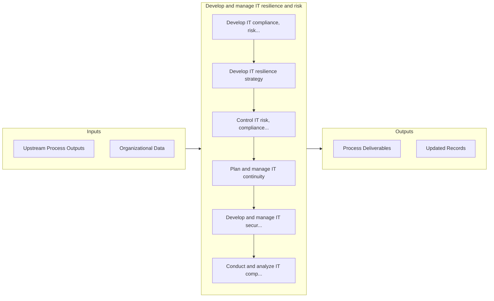

# Develop and manage IT resilience and risk

> Develop and include the processes required to rapidly adapt and respond to any internal or external opportunity, demand, disruption, or threat to IT.

## Overview

Group 8.3 is a process group within APQC Category 8.0 (Manage Information Technology). 

Develop and include the processes required to rapidly adapt and respond to any internal or external opportunity, demand, disruption, or threat to IT. Develop a more dynamic, strategic, and integrated approach to managing risk and compliance obligations.

## Process Hierarchy



## Key Statistics

| Metric | Value |
|--------|-------|
| APQC Code | 20706 |
| Hierarchy ID | 8.3 |
| Level | Group |
| Parent | [8](../) |
| Sub-Processes | 8 |


## GraphDL Semantic Structure

```graphdl
develop.AndManageITResilienceAndRisk
```

| Component | Value | Description |
|-----------|-------|-------------|
| Verb | `develop` | Primary action |
| Object | `and manage IT resilience and risk` | Direct object |


## Process Flow



## Sub-Processes

| Process | Hierarchy ID | Description |
|---------|-------------|-------------|
| [Develop IT compliance, risk, and security strategy](./8.3.1-DevelopITComplianceRisk/) | 8.3.1 | Ensuring that the organization effectively manages risk |
| [Develop IT resilience strategy](./8.3.2-DevelopITResilienceStrategy/) | 8.3.2 | Developing resilience strategies of IT across the organization so that prospective risks can be avoi |
| [Control IT risk, compliance, and security](./8.3.3-ControlITRiskCompliance/) | 8.3.3 | Ensure effective control in overall IT risk management, formulate and execute guidelines in-line wit |
| [Plan and manage IT continuity](./8.3.4-PlanManageITContinuity/) | 8.3.4 | Planning and managing IT's ability to recover from exposure to internal and external threats |
| [Develop and manage IT security, privacy, and data protection](./8.3.5-DevelopManageITSecurity/) | 8.3.5 | Creating and deploying an architecture for securing and ensuring the privacy of data flows throughou |
| [Conduct and analyze IT compliance assessments](./8.3.6-ConductAnalyzeITCompliance/) | 8.3.6 | Evaluate and analyze the IT environment for the compliance of industry regulations and government le |
| [Develop and execute IT resilience and continuity operations](./8.3.7-DevelopExecuteITResilience/) | 8.3.7 | Create and execute a process to rapidly adapt and respond to any internal or external opportunity, d |
| [Manage IT user identity and authorization](./8.3.8-ManageITUserIdentity/) | 8.3.8 | The process of identifying, authenticating, and authorizing IT users to have access to applications, |


## Related Concepts

- ITResilience
- Risk
- ITResilience
- Risk


---

*Source: APQC PCF 20706 (8.3) - APQC*
