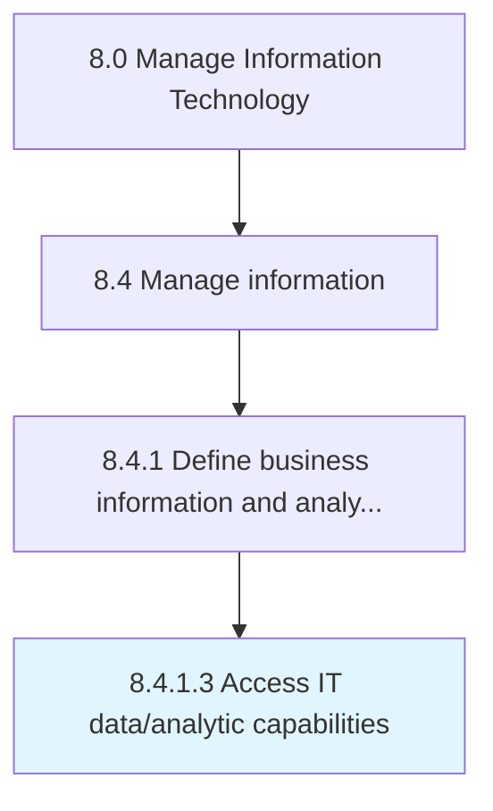

# Access IT data/analytic capabilities

> Determining the request for data accessibility and analysis.

## Overview

Activity 8.4.1.3 is an activity within the Manage Information Technology framework. 

Determining the request for data accessibility and analysis. Review the details based on internal data security policies and permit data access only if internal policies and data access parameters are met.

## Process Hierarchy



## Key Statistics

| Metric | Value |
|--------|-------|
| APQC Code | 20769 |
| Hierarchy ID | 8.4.1.3 |
| Level | Activity |
| Parent | [8.4.1](../) |
| Sub-Processes | 0 |


## GraphDL Semantic Structure

```
access.ITDataanalyticCapabilities
```

| Component | Value | Description |
|-----------|-------|-------------|
| Verb | `access` | Primary action |
| Object | `IT data/analytic capabilities` | Direct object |


## Related Concepts

- [ITDataCapabilities](/concepts/ITDataCapabilities)
- [ITAnalyticCapabilities](/concepts/ITAnalyticCapabilities)


---

*Source: APQC PCF 20769 (8.4.1.3) - APQC*
