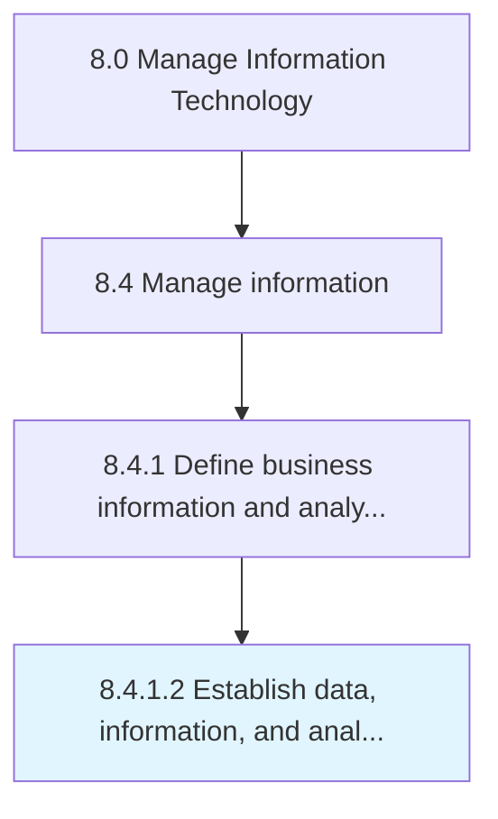

# Establish data, information, and analytic governance

> Creating a set of guidelines that ensure effective and efficient use of IT.

## Overview

Activity 8.4.1.2 is an activity within the Manage Information Technology framework. 

Creating a set of guidelines that ensure effective and efficient use of IT. Define data, information, and analytic governance to reach the organization's goal.

## Process Hierarchy



## Key Statistics

| Metric | Value |
|--------|-------|
| APQC Code | 20768 |
| Hierarchy ID | 8.4.1.2 |
| Level | Activity |
| Parent | [8.4.1](../) |
| Sub-Processes | 0 |


## GraphDL Semantic Structure

```
establish.DataInformationAndAnalyticGovernance
```

| Component | Value | Description |
|-----------|-------|-------------|
| Verb | `establish` | Primary action |
| Object | `data, information, and analytic governance` | Direct object |


## Related Concepts

- Data
- Information
- AnalyticGovernance


---

*Source: APQC PCF 20768 (8.4.1.2) - APQC*
