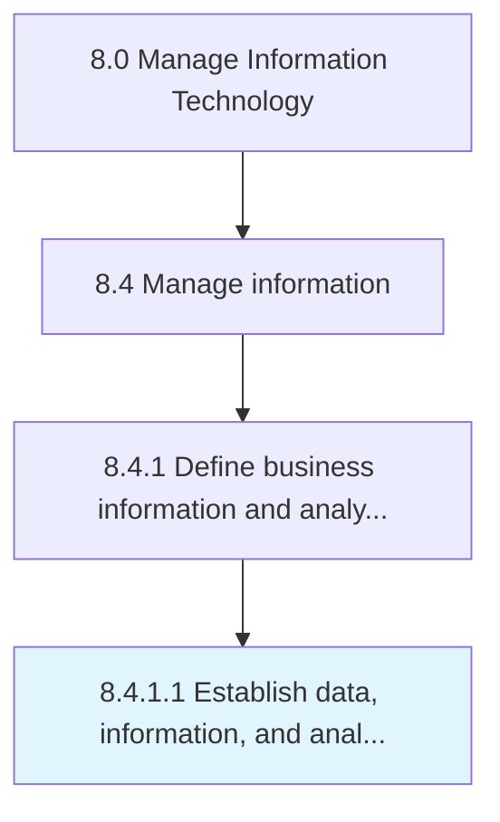

# Establish data, information, and analytic objectives

> Implementing strategies for securing and ensuring the privacy of data flows throughout the organization.

## Overview

Activity 8.4.1.1 is an activity within the Manage Information Technology framework. 

Implementing strategies for securing and ensuring the privacy of data flows throughout the organization. Create protocols and guidelines for individual IT components. Outline analytic objectives in order to avoid misuse of information.

## Process Hierarchy



## Key Statistics

| Metric | Value |
|--------|-------|
| APQC Code | 20767 |
| Hierarchy ID | 8.4.1.1 |
| Level | Activity |
| Parent | [8.4.1](../) |
| Sub-Processes | 0 |


## GraphDL Semantic Structure

```
establish.DataInformationAndAnalyticObjectives
```

| Component | Value | Description |
|-----------|-------|-------------|
| Verb | `establish` | Primary action |
| Object | `data, information, and analytic objectives` | Direct object |


## Related Concepts

- [Data](/concepts/Data)
- [Information](/concepts/Information)
- [AnalyticObjectives](/concepts/AnalyticObjectives)


---

*Source: APQC PCF 20767 (8.4.1.1) - APQC*
