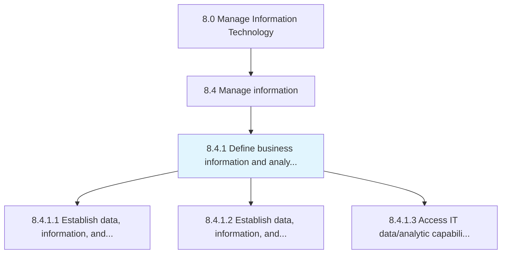
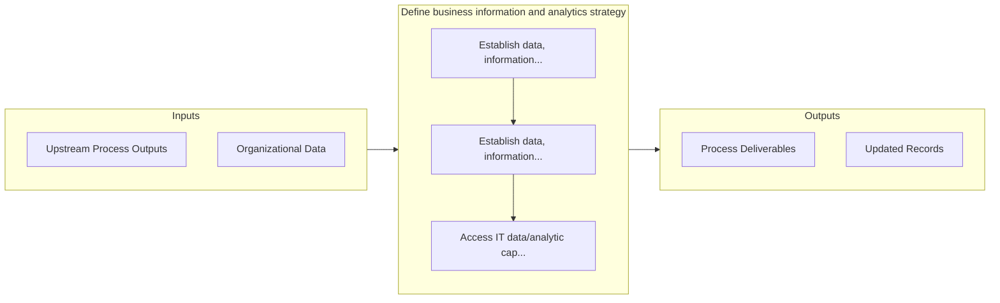

# Define business information and analytics strategy

> Create an organization-wide strategy for the IT function by combining skills, technologies, applications, and processes in order to attain organizations objectives.

## Overview

Process 8.4.1 is a core process that defines the specific procedures for define business information and analytics strategy. 

Create an organization-wide strategy for the IT function by combining skills, technologies, applications, and processes in order to attain organizations objectives.

## Process Hierarchy



## Key Statistics

| Metric | Value |
|--------|-------|
| APQC Code | 20766 |
| Hierarchy ID | 8.4.1 |
| Level | Process |
| Parent | [8.4](../) |
| Sub-Processes | 3 |


## GraphDL Semantic Structure

```
define.BusinessInformationAndAnalyticsStrategy
```

| Component | Value | Description |
|-----------|-------|-------------|
| Verb | `define` | Primary action |
| Object | `business information and analytics strategy` | Direct object |


## Process Flow



## Sub-Processes

| Process | Hierarchy ID | Description |
|---------|-------------|-------------|
| [Establish data, information, and analytic objectives](./EstablishDataInformationAndAnalyticObjectives) | 8.4.1.1 | Implementing strategies for securing and ensuring the privacy of data flows throughout the organizat |
| [Establish data, information, and analytic governance](./EstablishDataInformationAndAnalyticGovernance) | 8.4.1.2 | Creating a set of guidelines that ensure effective and efficient use of IT |
| [Access IT data/analytic capabilities](./AccessITDataanalyticCapabilities) | 8.4.1.3 | Determining the request for data accessibility and analysis |


## Related Concepts

- [BusinessInformationStrategy](/concepts/BusinessInformationStrategy)
- [AnalyticsStrategy](/concepts/AnalyticsStrategy)


---

*Source: APQC PCF 20766 (8.4.1) - APQC*
