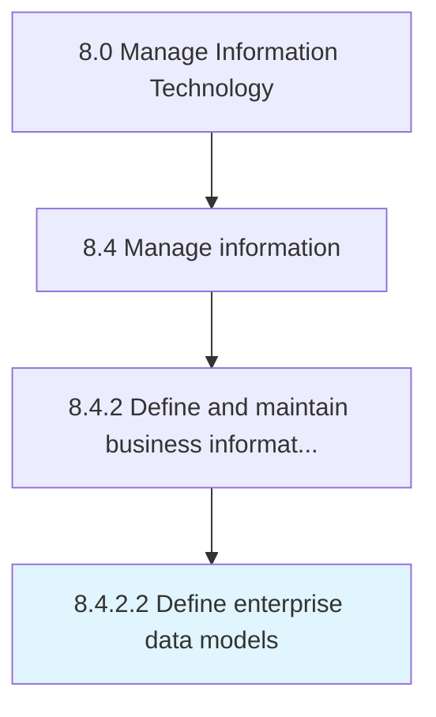

# Define enterprise data models

> Define different ways of representation, usage, and identification of data with independent or interdependent sources across the organization.

## Overview

Activity 8.4.2.2 is an activity within the Manage Information Technology framework. 

Define different ways of representation, usage, and identification of data with independent or interdependent sources across the organization.

## Process Hierarchy



## Key Statistics

| Metric | Value |
|--------|-------|
| APQC Code | 20772 |
| Hierarchy ID | 8.4.2.2 |
| Level | Activity |
| Parent | [8.4.2](../) |
| Sub-Processes | 0 |


## GraphDL Semantic Structure

```
define.EnterpriseDataModels
```

| Component | Value | Description |
|-----------|-------|-------------|
| Verb | `define` | Primary action |
| Object | `enterprise data models` | Direct object |


## Related Concepts

- EnterpriseDataModels


---

*Source: APQC PCF 20772 (8.4.2.2) - APQC*
