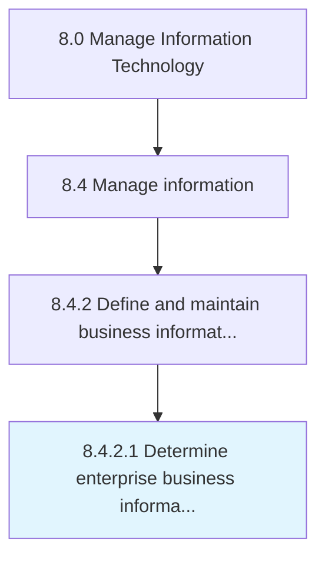

# Determine enterprise business information requirements

> Determining strategies to manage the enterprise wide flow of business information and content.

## Overview

Activity 8.4.2.1 is an activity within the Manage Information Technology framework. 

Determining strategies to manage the enterprise wide flow of business information and content. Outline the required architecture for information resources.

## Process Hierarchy



## Key Statistics

| Metric | Value |
|--------|-------|
| APQC Code | 20771 |
| Hierarchy ID | 8.4.2.1 |
| Level | Activity |
| Parent | [8.4.2](../) |
| Sub-Processes | 0 |


## GraphDL Semantic Structure

```
determine.EnterpriseBusinessInformationRequirements
```

| Component | Value | Description |
|-----------|-------|-------------|
| Verb | `determine` | Primary action |
| Object | `enterprise business information requirements` | Direct object |


## Related Concepts

- [EnterpriseBusinessInformationRequirements](/concepts/EnterpriseBusinessInformationRequirements)


---

*Source: APQC PCF 20771 (8.4.2.1) - APQC*
