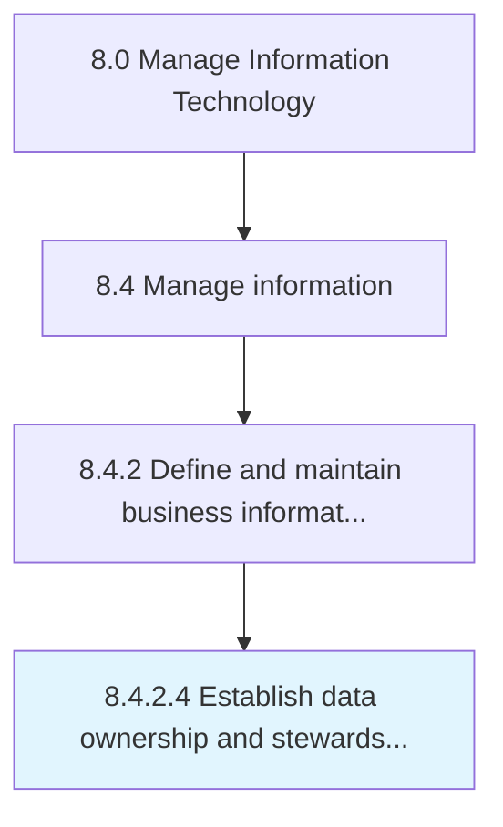

# Establish data ownership and stewardship responsibilities

> Establishing entities responsible for data accuracy, integrity, and timeliness that can authorize or deny access to certain data.

## Overview

Activity 8.4.2.4 is an activity within the Manage Information Technology framework. 

Establishing entities responsible for data accuracy, integrity, and timeliness that can authorize or deny access to certain data. Develop data utilizing governance processes to ensure fitness of data elements.

## Process Hierarchy



## Key Statistics

| Metric | Value |
|--------|-------|
| APQC Code | 20774 |
| Hierarchy ID | 8.4.2.4 |
| Level | Activity |
| Parent | [8.4.2](../) |
| Sub-Processes | 0 |


## GraphDL Semantic Structure

```
establish.DataOwnershipAndStewardshipResponsibilities
```

| Component | Value | Description |
|-----------|-------|-------------|
| Verb | `establish` | Primary action |
| Object | `data ownership and stewardship responsibilities` | Direct object |


## Related Concepts

- [DataOwnershipResponsibilities](/concepts/DataOwnershipResponsibilities)
- [StewardshipResponsibilities](/concepts/StewardshipResponsibilities)


---

*Source: APQC PCF 20774 (8.4.2.4) - APQC*
