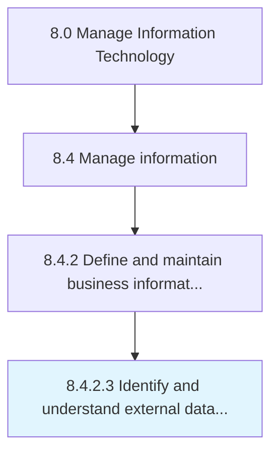

# Identify and understand external data sources

> Identifying and understanding external sources of data in relevance of reliability, security, and authenticity.

## Overview

Activity 8.4.2.3 is an activity within the Manage Information Technology framework. 

Identifying and understanding external sources of data in relevance of reliability, security, and authenticity.

## Process Hierarchy



## Key Statistics

| Metric | Value |
|--------|-------|
| APQC Code | 20773 |
| Hierarchy ID | 8.4.2.3 |
| Level | Activity |
| Parent | [8.4.2](../) |
| Sub-Processes | 0 |


## GraphDL Semantic Structure

```
identify.AndUnderstandExternalDataSources
```

| Component | Value | Description |
|-----------|-------|-------------|
| Verb | `identify` | Primary action |
| Object | `and understand external data sources` | Direct object |


## Related Concepts

- ExternalDataSources
- ExternalDataSources


---

*Source: APQC PCF 20773 (8.4.2.3) - APQC*
