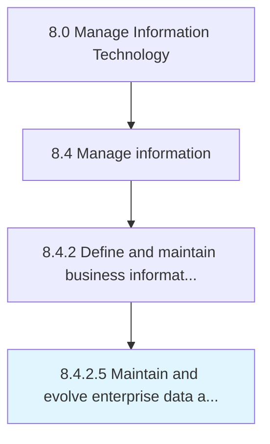

# Maintain and evolve enterprise data and information architecture

> Creating and maintaining the process of designing, creating, deploying, and managing strategies to maintain enterprise data and information architecture.

## Overview

Activity 8.4.2.5 is an activity within the Manage Information Technology framework. 

Creating and maintaining the process of designing, creating, deploying, and managing strategies to maintain enterprise data and information architecture.

## Process Hierarchy



## Key Statistics

| Metric | Value |
|--------|-------|
| APQC Code | 20775 |
| Hierarchy ID | 8.4.2.5 |
| Level | Activity |
| Parent | [8.4.2](../) |
| Sub-Processes | 0 |


## GraphDL Semantic Structure

```
maintain.AndEvolveEnterpriseDataAndInformationArchitecture
```

| Component | Value | Description |
|-----------|-------|-------------|
| Verb | `maintain` | Primary action |
| Object | `and evolve enterprise data and information architecture` | Direct object |


## Related Concepts

- EnterpriseDataArchitecture
- InformationArchitecture
- EnterpriseDataArchitecture
- InformationArchitecture


---

*Source: APQC PCF 20775 (8.4.2.5) - APQC*
