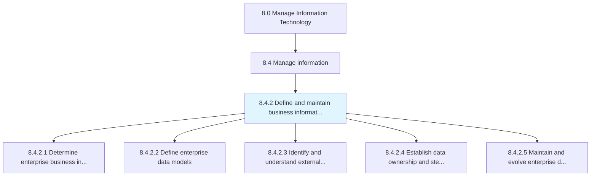
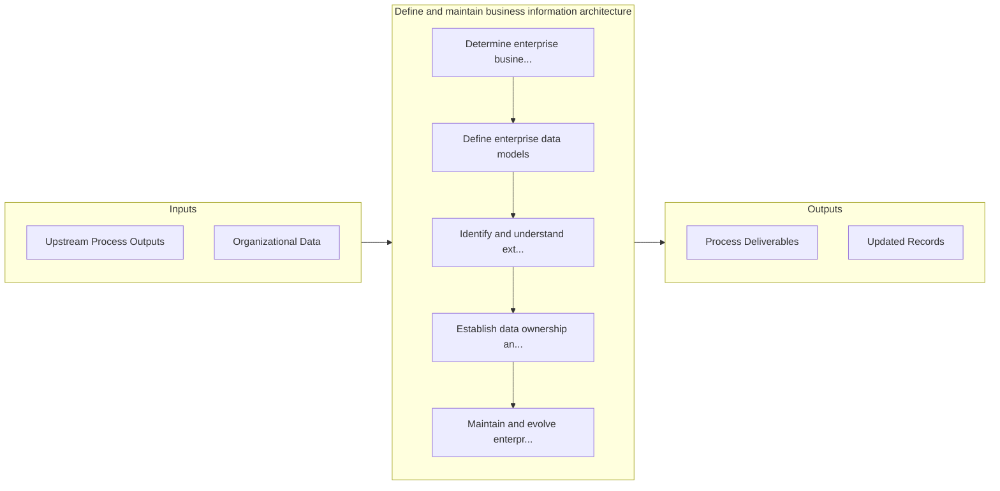

# Define and maintain business information architecture

> Creating strategies to manage the organization's information and content.

## Overview

Process 8.4.2 is a core process that defines the specific procedures for define and maintain business information architecture. 

Creating strategies to manage the organization's information and content. Outline the architecture for information collection and communication. Administer information resources, data management and content.

## Process Hierarchy



## Key Statistics

| Metric | Value |
|--------|-------|
| APQC Code | 20770 |
| Hierarchy ID | 8.4.2 |
| Level | Process |
| Parent | [8.4](../) |
| Sub-Processes | 5 |


## GraphDL Semantic Structure

```
define.AndMaintainBusinessInformationArchitecture
```

| Component | Value | Description |
|-----------|-------|-------------|
| Verb | `define` | Primary action |
| Object | `and maintain business information architecture` | Direct object |


## Process Flow



## Sub-Processes

| Process | Hierarchy ID | Description |
|---------|-------------|-------------|
| [Determine enterprise business information requirements](./DetermineEnterpriseBusinessInformationRequirements) | 8.4.2.1 | Determining strategies to manage the enterprise wide flow of business information and content |
| [Define enterprise data models](./DefineEnterpriseDataModels) | 8.4.2.2 | Define different ways of representation, usage, and identification of data with independent or inter |
| [Identify and understand external data sources](./IdentifyAndUnderstandExternalDataSources) | 8.4.2.3 | Identifying and understanding external sources of data in relevance of reliability, security, and au |
| [Establish data ownership and stewardship responsibilities](./EstablishDataOwnershipAndStewardshipResponsibilities) | 8.4.2.4 | Establishing entities responsible for data accuracy, integrity, and timeliness that can authorize or |
| [Maintain and evolve enterprise data and information architecture](./MaintainAndEvolveEnterpriseDataAndInformationArchitecture) | 8.4.2.5 | Creating and maintaining the process of designing, creating, deploying, and managing strategies to m |


## Related Concepts

- [BusinessInformationArchitecture](/concepts/BusinessInformationArchitecture)
- [BusinessInformationArchitecture](/concepts/BusinessInformationArchitecture)


---

*Source: APQC PCF 20770 (8.4.2) - APQC*
