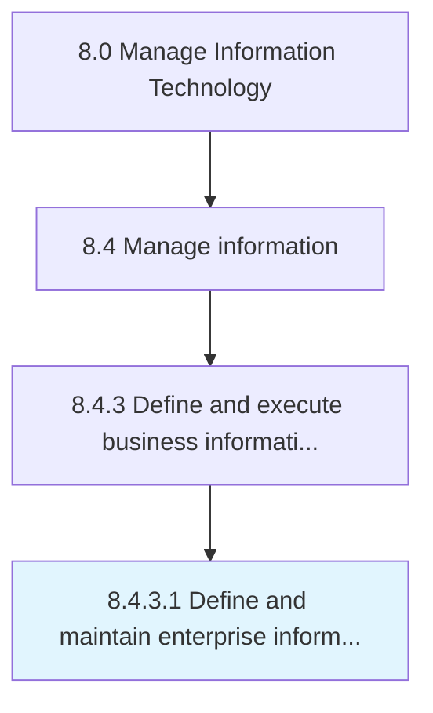

# Define and maintain enterprise information policies, standards, and procedures

> Outlining and establishing policies for information and setting information standards and procedures.

## Overview

Activity 8.4.3.1 is an activity within the Manage Information Technology framework. 

Outlining and establishing policies for information and setting information standards and procedures. Establish policies to regulate the creation, use, storage, access, communication, and dissemination of information.

## Process Hierarchy



## Key Statistics

| Metric | Value |
|--------|-------|
| APQC Code | 20777 |
| Hierarchy ID | 8.4.3.1 |
| Level | Activity |
| Parent | [8.4.3](../) |
| Sub-Processes | 0 |


## GraphDL Semantic Structure

```
define.AndMaintainEnterpriseInformationPoliciesStandardsAndProcedures
```

| Component | Value | Description |
|-----------|-------|-------------|
| Verb | `define` | Primary action |
| Object | `and maintain enterprise information policies, standards, and procedures` | Direct object |


## Related Concepts

- EnterpriseInformationPolicies
- Standards
- Procedures
- EnterpriseInformationPolicies
- Standards
- Procedures


---

*Source: APQC PCF 20777 (8.4.3.1) - APQC*
