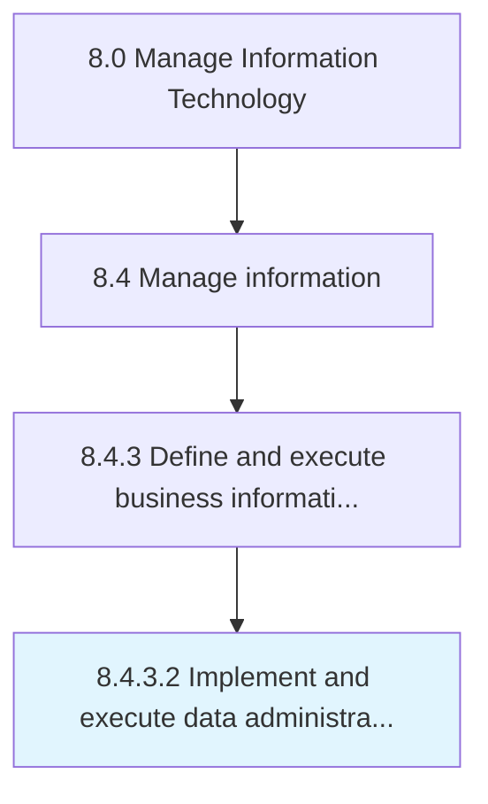

# Implement and execute data administration responsibilities

> Implementing and executing strategies for processes and technologies that support the collection, managing, and storing of data.

## Overview

Activity 8.4.3.2 is an activity within the Manage Information Technology framework. 

Implementing and executing strategies for processes and technologies that support the collection, managing, and storing of data.

## Process Hierarchy



## Key Statistics

| Metric | Value |
|--------|-------|
| APQC Code | 20778 |
| Hierarchy ID | 8.4.3.2 |
| Level | Activity |
| Parent | [8.4.3](../) |
| Sub-Processes | 0 |


## GraphDL Semantic Structure

```
implement.AndExecuteDataAdministrationResponsibilities
```

| Component | Value | Description |
|-----------|-------|-------------|
| Verb | `implement` | Primary action |
| Object | `and execute data administration responsibilities` | Direct object |


## Related Concepts

- [DataAdministrationResponsibilities](/concepts/DataAdministrationResponsibilities)
- [DataAdministrationResponsibilities](/concepts/DataAdministrationResponsibilities)


---

*Source: APQC PCF 20778 (8.4.3.2) - APQC*
