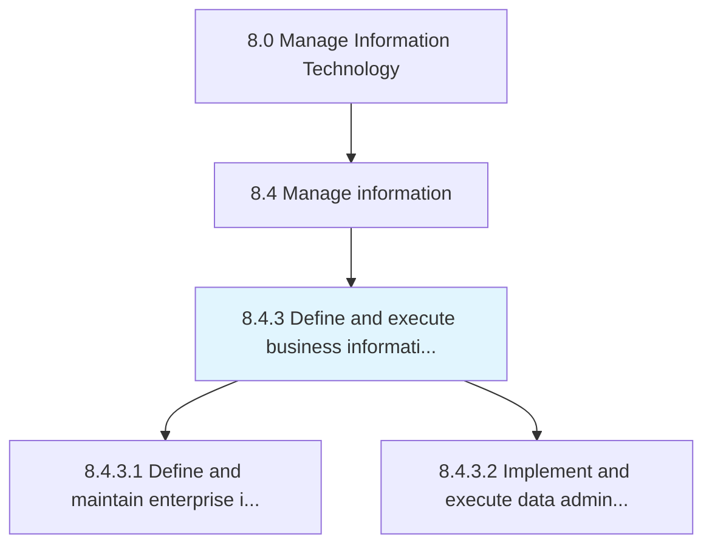
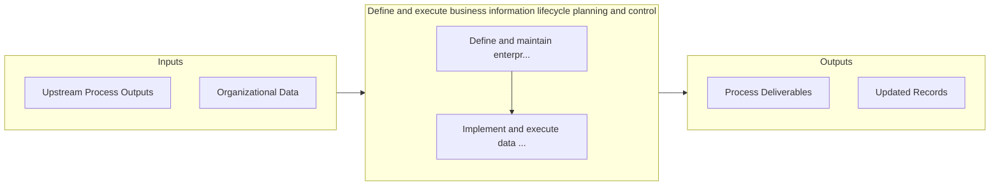

# Define and execute business information lifecycle planning and control

> Develop and implement strategies to plan and manage the flow of an information system's data from creation and initial storage to the time when it becomes obsolete and deleted.

## Overview

Process 8.4.3 is a core process that defines the specific procedures for define and execute business information lifecycle planning and control. 

Develop and implement strategies to plan and manage the flow of an information system's data from creation and initial storage to the time when it becomes obsolete and deleted.

## Process Hierarchy



## Key Statistics

| Metric | Value |
|--------|-------|
| APQC Code | 20776 |
| Hierarchy ID | 8.4.3 |
| Level | Process |
| Parent | [8.4](../) |
| Sub-Processes | 2 |


## Process Overview

Information technology processes manage IT strategy, services, solutions, and support to enable business operations. This process focuses on define and execute business information lifecycle planning and control, which is essential for organizational effectiveness and achieving business objectives.

## Key Metrics

| Metric | Description | Target |
|--------|-------------|--------|
| System uptime | Measure of system uptime | Target varies by organization |
| IT cost per employee | Measure of it cost per employee | Target varies by organization |
| Project on-time delivery | Measure of project on-time delivery | Target varies by organization |
| Security incidents | Measure of security incidents | Target varies by organization |

## Related Departments

- [Technology](/departments/Technology)
- [Security](/departments/Security)
- [Data Analytics](/departments/Data Analytics)

## Related Occupations

- [IT Managers](/occupations/Management/ComputerAndInformationSystemsManagers)
- [Software Developers](/occupations/Technology/SoftwareDevelopers)
- [Systems Analysts](/occupations/Technology/ComputerSystemsAnalysts)

## RACI Matrix

| Activity | Responsible | Accountable | Consulted | Informed |
|----------|-------------|-------------|-----------|----------|
| Plan | Process Owner | Manager | Stakeholders | Team |
| Execute | Team | Process Owner | Manager | Stakeholders |
| Monitor | Analyst | Manager | Process Owner | Leadership |
| Improve | Process Owner | Manager | Team | Stakeholders |

## GraphDL Semantic Structure

```graphdl
define.AndExecuteBusinessInformationLifecyclePlanningAndControl
```

| Component | Value | Description |
|-----------|-------|-------------|
| Verb | `define` | Primary action |
| Object | `and execute business information lifecycle planning and control` | Direct object |


## Process Flow



## Sub-Processes

| Process | Hierarchy ID | Description |
|---------|-------------|-------------|
| [Define and maintain enterprise information policies, standards, and procedures](./DefineAndMaintainEnterpriseInformationPoliciesStandardsAndProcedures) | 8.4.3.1 | Outlining and establishing policies for information and setting information standards and procedures |
| [Implement and execute data administration responsibilities](./ImplementAndExecuteDataAdministrationResponsibilities) | 8.4.3.2 | Implementing and executing strategies for processes and technologies that support the collection, ma |


## Related Concepts

- BusinessInformationLifecyclePlanning
- Control
- BusinessInformationLifecyclePlanning
- Control


---

*Source: APQC PCF 20776 (8.4.3) - APQC*
