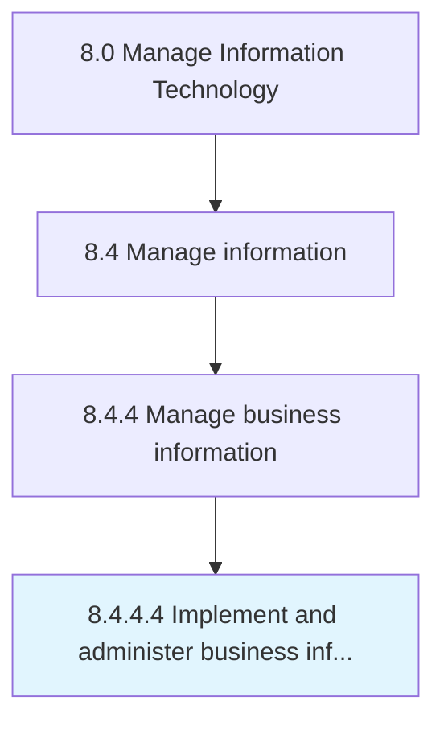

# Implement and administer business information access

> Implement and manage the process for accessing information including issues related to copyright, open source, privacy, and security.

## Overview

Activity 8.4.4.4 is an activity within the Manage Information Technology framework. 

Implement and manage the process for accessing information including issues related to copyright, open source, privacy, and security.

## Process Hierarchy



## Key Statistics

| Metric | Value |
|--------|-------|
| APQC Code | 20783 |
| Hierarchy ID | 8.4.4.4 |
| Level | Activity |
| Parent | [8.4.4](../) |
| Sub-Processes | 0 |


## GraphDL Semantic Structure

```
implement.AndAdministerBusinessInformationAccess
```

| Component | Value | Description |
|-----------|-------|-------------|
| Verb | `implement` | Primary action |
| Object | `and administer business information access` | Direct object |


## Related Concepts

- [BusinessInformationAccess](/concepts/BusinessInformationAccess)
- [BusinessInformationAccess](/concepts/BusinessInformationAccess)


---

*Source: APQC PCF 20783 (8.4.4.4) - APQC*
