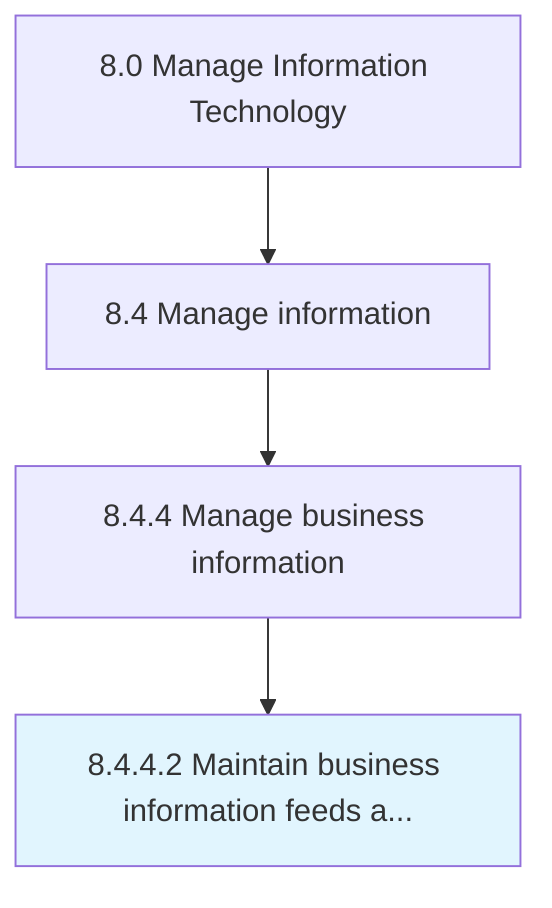

# Maintain business information feeds and repositories

> Maintain information feedstock along with IT hardware and software needed for storage, access, and retrieval of business information.

## Overview

Activity 8.4.4.2 is an activity within the Manage Information Technology framework. 

Maintain information feedstock along with IT hardware and software needed for storage, access, and retrieval of business information.

## Process Hierarchy



## Key Statistics

| Metric | Value |
|--------|-------|
| APQC Code | 20781 |
| Hierarchy ID | 8.4.4.2 |
| Level | Activity |
| Parent | [8.4.4](../) |
| Sub-Processes | 0 |


## GraphDL Semantic Structure

```
maintain.BusinessInformationFeedsAndRepositories
```

| Component | Value | Description |
|-----------|-------|-------------|
| Verb | `maintain` | Primary action |
| Object | `business information feeds and repositories` | Direct object |


## Related Concepts

- BusinessInformationFeeds
- Repositories


---

*Source: APQC PCF 20781 (8.4.4.2) - APQC*
