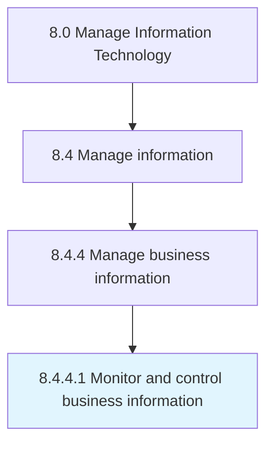

# Monitor and control business information

> Defining the rules, diction, and logic that make up the framework of the organization's information architecture.

## Overview

Activity 8.4.4.1 is an activity within the Manage Information Technology framework. 

Defining the rules, diction, and logic that make up the framework of the organization's information architecture. Monitoring and controlling information attributes that flow through the IT framework.

## Process Hierarchy



## Key Statistics

| Metric | Value |
|--------|-------|
| APQC Code | 20780 |
| Hierarchy ID | 8.4.4.1 |
| Level | Activity |
| Parent | [8.4.4](../) |
| Sub-Processes | 0 |


## GraphDL Semantic Structure

```
monitor.AndControlBusinessInformation
```

| Component | Value | Description |
|-----------|-------|-------------|
| Verb | `monitor` | Primary action |
| Object | `and control business information` | Direct object |


## Related Concepts

- [BusinessInformation](/concepts/BusinessInformation)
- [BusinessInformation](/concepts/BusinessInformation)


---

*Source: APQC PCF 20780 (8.4.4.1) - APQC*
