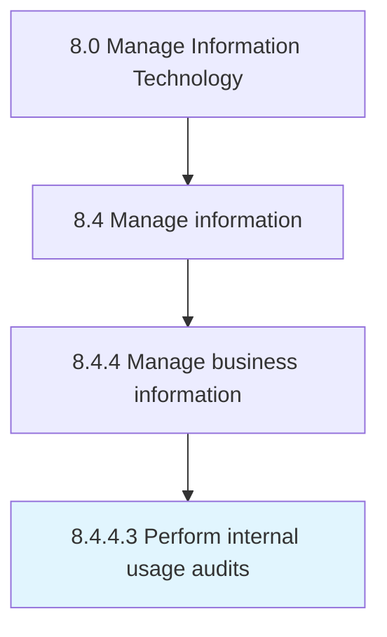

# Perform internal usage audits

> Verification of information access and usage through regular reports on organizational performance.

## Overview

Activity 8.4.4.3 is an activity within the Manage Information Technology framework. 

Verification of information access and usage through regular reports on organizational performance.

## Process Hierarchy



## Key Statistics

| Metric | Value |
|--------|-------|
| APQC Code | 20782 |
| Hierarchy ID | 8.4.4.3 |
| Level | Activity |
| Parent | [8.4.4](../) |
| Sub-Processes | 0 |


## GraphDL Semantic Structure

```
perform.InternalUsageAudits
```

| Component | Value | Description |
|-----------|-------|-------------|
| Verb | `perform` | Primary action |
| Object | `internal usage audits` | Direct object |


## Related Concepts

- InternalUsageAudits


---

*Source: APQC PCF 20782 (8.4.4.3) - APQC*
