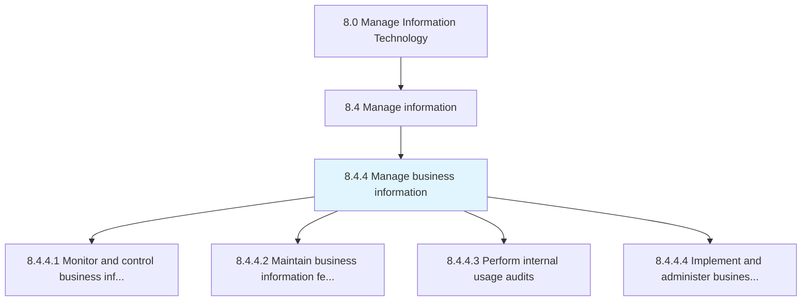
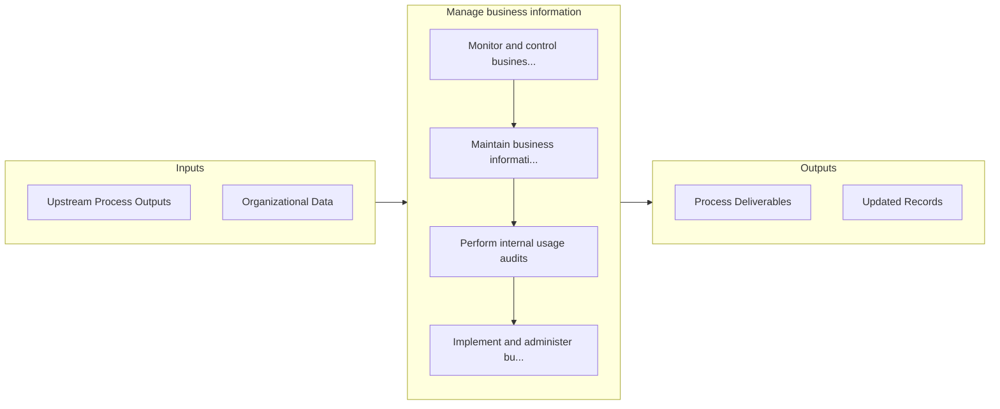

# Manage business information

> Creating strategies to administer information and content.

## Overview

Process 8.4.4 is a core process that defines the specific procedures for manage business information. 

Creating strategies to administer information and content. Understand the needs of the organization for information and content management. Realize the role of IT services for implementing the overall business strategy. Assess the implications of new technologies for managing information and content. Identify and prioritize the most effective and efficient actions for managing information and content.

## Process Hierarchy



## Key Statistics

| Metric | Value |
|--------|-------|
| APQC Code | 20779 |
| Hierarchy ID | 8.4.4 |
| Level | Process |
| Parent | [8.4](../) |
| Sub-Processes | 4 |


## GraphDL Semantic Structure

```graphdl
manage.BusinessInformation
```

| Component | Value | Description |
|-----------|-------|-------------|
| Verb | `manage` | Primary action |
| Object | `business information` | Direct object |


## Process Flow



## Sub-Processes

| Process | Hierarchy ID | Description |
|---------|-------------|-------------|
| [Monitor and control business information](./MonitorAndControlBusinessInformation) | 8.4.4.1 | Defining the rules, diction, and logic that make up the framework of the organization's information  |
| [Maintain business information feeds and repositories](./MaintainBusinessInformationFeedsAndRepositories) | 8.4.4.2 | Maintain information feedstock along with IT hardware and software needed for storage, access, and r |
| [Perform internal usage audits](./PerformInternalUsageAudits) | 8.4.4.3 | Verification of information access and usage through regular reports on organizational performance |
| [Implement and administer business information access](./ImplementAndAdministerBusinessInformationAccess) | 8.4.4.4 | Implement and manage the process for accessing information including issues related to copyright, op |


## Related Concepts

- BusinessInformation


---

*Source: APQC PCF 20779 (8.4.4) - APQC*
