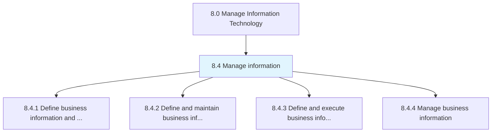
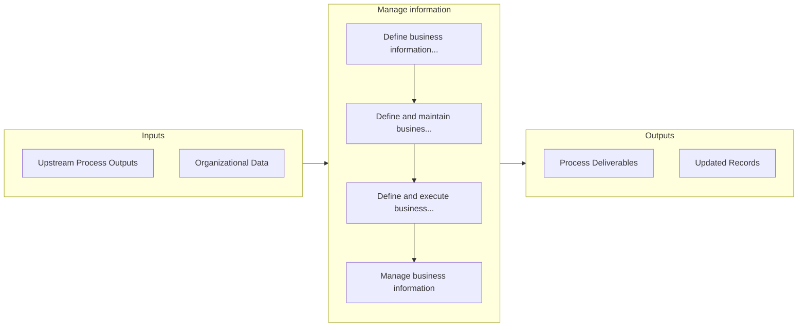

# Manage information

> Creating strategies to manage the organization's information and content.

## Overview

Group 8.4 is a process group within APQC Category 8.0 (Manage Information Technology). 

Creating strategies to manage the organization's information and content. Outline the architecture for information. Administer information resources. Administer the management of data and content.

## Process Hierarchy



## Key Statistics

| Metric | Value |
|--------|-------|
| APQC Code | 20765 |
| Hierarchy ID | 8.4 |
| Level | Group |
| Parent | [8](../) |
| Sub-Processes | 4 |


## GraphDL Semantic Structure

```graphdl
manage.Information
```

| Component | Value | Description |
|-----------|-------|-------------|
| Verb | `manage` | Primary action |
| Object | `information` | Direct object |


## Process Flow



## Sub-Processes

| Process | Hierarchy ID | Description |
|---------|-------------|-------------|
| [Define business information and analytics strategy](./8.4.1-DefineBusinessInformationAnalytics/) | 8.4.1 | Create an organization-wide strategy for the IT function by combining skills, technologies, applicat |
| [Define and maintain business information architecture](./8.4.2-DefineMaintainBusinessInformation/) | 8.4.2 | Creating strategies to manage the organization's information and content |
| [Define and execute business information lifecycle planning and control](./8.4.3-DefineExecuteBusinessInformation/) | 8.4.3 | Develop and implement strategies to plan and manage the flow of an information system's data from cr |
| [Manage business information](./8.4.4-ManageBusinessInformation/) | 8.4.4 | Creating strategies to administer information and content |


## Related Concepts

- Information


---

*Source: APQC PCF 20765 (8.4) - APQC*
