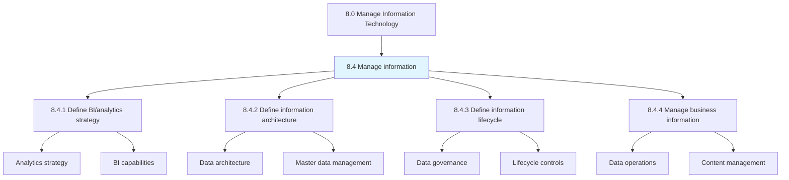
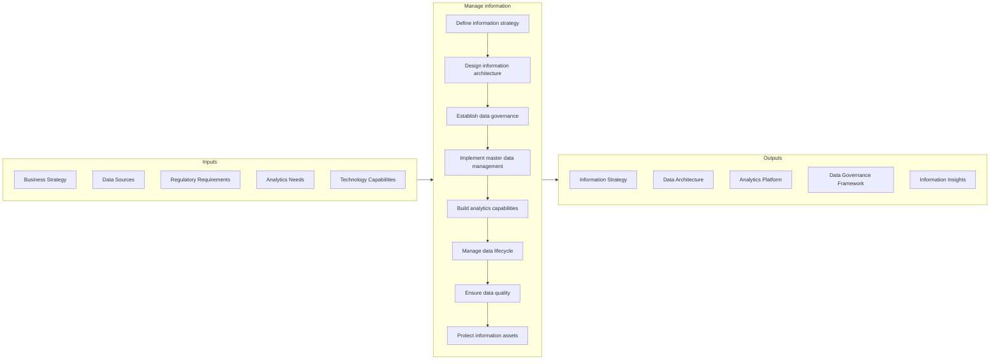
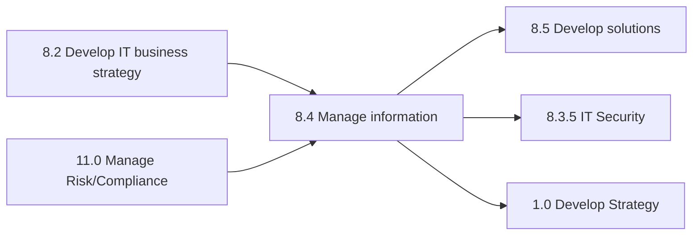

# Manage information

> Creating strategies to manage the organization's information and content.

## Overview

Group 8.4 is a process group within APQC Category 8.0 (Manage Information Technology). This process group establishes the framework for treating information as a strategic enterprise asset.

Creating strategies to manage the organization's information and content. Outline the architecture for information. Administer information resources. Administer the management of data and content.

Effective information management enables data-driven decision making, regulatory compliance, operational efficiency, and competitive advantage. This process group encompasses data governance, master data management, business intelligence, analytics, and information lifecycle management.

In the era of big data and AI, this process group has become increasingly critical. Organizations that excel at information management can extract insights from data, ensure data quality and integrity, protect sensitive information, and comply with data privacy regulations.

## Process Hierarchy



## Key Statistics

| Metric | Value |
|--------|-------|
| APQC Code | 20765 |
| Hierarchy ID | 8.4 |
| Level | Group |
| Parent | [8](../) |
| Sub-Processes | 4 |
| Activities | 15+ |
| Industry Variants | 19 |

## GraphDL Semantic Structure

```graphdl
manage.Information
govern.EnterpriseData
enable.BusinessAnalytics
```

| Component | Value | Description |
|-----------|-------|-------------|
| Verb | `manage` | Primary action of overseeing information assets |
| Object | `information` | Enterprise data and content |

## Process Flow



## Child Process Listings

### 8.4.1 - Define business information and analytics strategy

Create an organization-wide strategy for the IT function by combining skills, technologies, applications, and processes. This process establishes the vision for leveraging information as a strategic asset.

**Key Activities:**
- Define analytics and BI vision
- Assess current capabilities and gaps
- Establish analytics roadmap
- Define data science capabilities
- Align with business priorities

[View Process Details](./8.4.1-DefineBusinessInformationAnalytics/)

### 8.4.2 - Define and maintain business information architecture

Creating strategies to manage the organization's information and content. This process establishes the structural framework for enterprise data.

**Key Activities:**
- Design enterprise data architecture
- Define data standards and models
- Establish master data management
- Design integration patterns
- Maintain metadata repository

[View Process Details](./8.4.2-DefineMaintainBusinessInformation/)

### 8.4.3 - Define and execute business information lifecycle planning and control

Develop and implement strategies to plan and manage the flow of an information system's data from creation through disposition. This process ensures data is managed throughout its lifecycle.

**Key Activities:**
- Define data governance framework
- Establish data stewardship
- Implement data quality controls
- Manage data retention and archival
- Ensure regulatory compliance

[View Process Details](./8.4.3-DefineExecuteBusinessInformation/)

### 8.4.4 - Manage business information

Creating strategies to administer information and content. This process operationalizes information management on a day-to-day basis.

**Key Activities:**
- Execute data operations
- Monitor data quality
- Manage content repositories
- Provide data services
- Support analytics delivery

[View Process Details](./8.4.4-ManageBusinessInformation/)

## RACI Matrix

| Activity | Chief Data Officer | Data Architect | Data Governance Lead | BI Manager | Data Stewards | CIO |
|----------|-------------------|----------------|---------------------|------------|---------------|-----|
| Define information strategy | R | C | C | C | I | A |
| Design data architecture | C | R | C | C | I | A |
| Establish data governance | R | C | R | I | C | A |
| Implement MDM | C | R | C | I | R | A |
| Build analytics capabilities | C | C | I | R | I | A |
| Manage data lifecycle | R | C | R | I | R | I |
| Ensure data quality | R | C | C | C | R | I |
| Protect information assets | R | C | R | I | C | A |

**Legend:** R = Responsible, A = Accountable, C = Consulted, I = Informed

## Metrics and KPIs

| Metric | Description | Target | Frequency |
|--------|-------------|--------|-----------|
| Data Quality Score | Composite measure of accuracy, completeness, timeliness | >90% | Monthly |
| Analytics Adoption Rate | Percentage of users actively using BI tools | >70% | Monthly |
| Data Governance Compliance | Percentage of data assets under governance | >85% | Quarterly |
| Master Data Accuracy | Accuracy of master data records | >98% | Monthly |
| Data Integration Success Rate | Percentage of successful data integrations | >99% | Weekly |
| Time to Insight | Average time from data request to insight delivery | <5 days | Per request |
| Data Security Incidents | Number of data security breaches | 0 | Monthly |
| Regulatory Compliance | Compliance with data regulations (GDPR, etc.) | 100% | Quarterly |
| Self-Service Analytics Ratio | Percentage of analytics served self-service | >60% | Monthly |
| Data Lineage Coverage | Percentage of data with documented lineage | >80% | Quarterly |

## Related Departments

- [Data Management](/departments/IT/DataManagement) - Data operations and governance
- [Business Intelligence](/departments/IT/BusinessIntelligence) - Analytics and reporting
- [Enterprise Architecture](/departments/IT/Architecture) - Data architecture
- [Information Security](/departments/IT/Security) - Data protection
- [Compliance](/departments/Compliance) - Regulatory data requirements
- [Business Analytics](/departments/Analytics) - Business insight delivery

## Related Occupations

- [Database Administrators](/occupations/Technology/Database/DatabaseAdministrators) - Data infrastructure management
- [Data Scientists](/occupations/Technology/Analysis/DataScientists) - Advanced analytics
- [Computer and Information Research Scientists](/occupations/Technology/Research/ComputerInformationResearchScientists) - Analytics innovation
- [Management Analysts](/occupations/Business/Operations/ManagementAnalysts) - Business intelligence
- [Information Security Analysts](/occupations/Technology/Security/InformationSecurityAnalysts) - Data protection
- [Statisticians](/occupations/Math/Statisticians) - Statistical analysis

## Related Concepts

- Information
- DataGovernance
- BusinessIntelligence
- Analytics
- MasterDataManagement
- DataArchitecture

## Related Processes



---

*Source: APQC PCF 20765 (8.4) - APQC*
