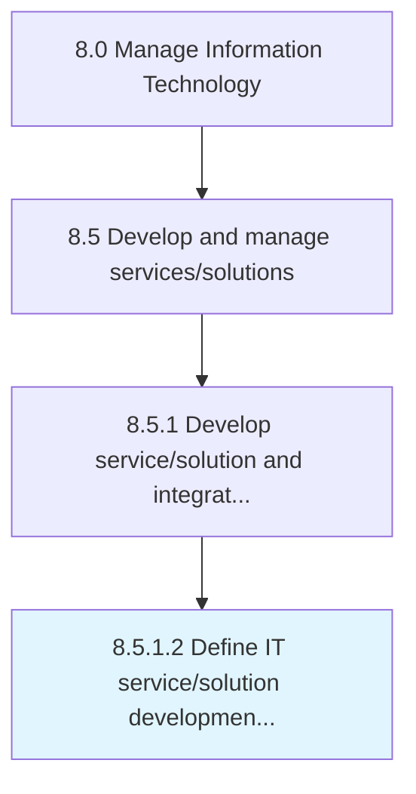

# Define IT service/solution development processes/standards

> Establishing the methods and processes as the foundation for developing new IT platforms, components, software, and explore new standards for better IT usage in the organization.

## Overview

Activity 8.5.1.2 is an activity within the Manage Information Technology framework. 

Establishing the methods and processes as the foundation for developing new IT platforms, components, software, and explore new standards for better IT usage in the organization.

## Process Hierarchy



## Key Statistics

| Metric | Value |
|--------|-------|
| APQC Code | 20787 |
| Hierarchy ID | 8.5.1.2 |
| Level | Activity |
| Parent | [8.5.1](../) |
| Sub-Processes | 0 |


## GraphDL Semantic Structure

```
define.ITServicesolutionDevelopmentProcessesstandards
```

| Component | Value | Description |
|-----------|-------|-------------|
| Verb | `define` | Primary action |
| Object | `IT service/solution development processes/standards` | Direct object |


## Related Concepts

- [ITService](/concepts/ITService)
- [ITSolutionDevelopmentProcesses](/concepts/ITSolutionDevelopmentProcesses)
- [ITStandards](/concepts/ITStandards)


---

*Source: APQC PCF 20787 (8.5.1.2) - APQC*
